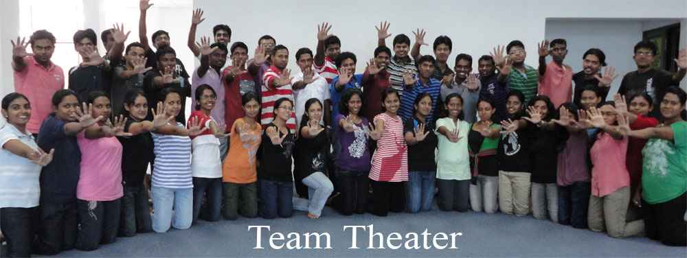

  

Morning alarm in my mobile rings at 6:45 am .I woke up in hurry and was disappointed to realize that the workshop is over and i need not to wake up early. But that was a dream actually. After that i Kept recalling the loads of fun and leanings which I had on previous day and then went back to dreams once again.

  

Everyone in my batch,Was Wondering, what is really the purpose of Team Work?And they found out the answer at last HOW: After attending this fun filled, dynamic and life transforming workshop “TEAM  THEATER”

  

  

We were put through various acting based exercises and games. The sessions are divided between discussion and practical with lots of games and exercises, always leaving my colleagues hungry for more. 

  

I will not describe what I have done in that workshop and about the events, words are not enough. Though I never made it big in theater or films, This theater helped me overcome my stage fright. It gave me the confidence to maintain my composure before audiences. Voice, diction, it covers everything.

  

And this theater workshop came at a time when I was not doing too great. I had just left my university and joined my first job, and was wondering what to do next. It’s not very easy to stand up in front of 50-60 people and perform but when you get that kind of from others it becomes a piece of cake. Today i am proud of that and after that day I was never scared to make a mistake.

  

It’s a workshop which is definitely worth enrolling. In addition to that I have met friends from with different aspects of life. Hats off to wonderful Director of the movie “TEAM THEATER ” MR.Jagath Jayasekara!
