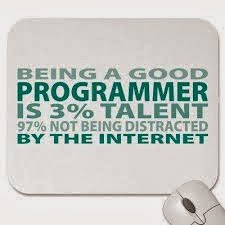

I am not a great programmer, but i love coding and trying my best to become a good coder, there are few things i got to know when i made a research on how to become an efficient programmer.  
  
1\. **Search for a problem** that's really annoying you that's tractable to being solved by some way of automation.  
  
 2. **Made a Google search** for **programmatic solutions** to these kind of problems. Make a research on which languages are most commonly used and scalable to satisfy your wider needs. In all ways.  
  
  3. Start trying to solve the problem by **breaking down the problem** down into smaller and smaller chunks and trying to find ways of implementing a solution in the language which you have chosen from the above step  
  
4 .**Code all the time, continuous practice** whenever you have time. Keep trying to solve your problem- where you get stuck, follow people who seem to know what they're doing on github,stackoverflow and post their solutions. Ask whatever questions may be even if its not practical on **stack overflow**(If you don’t care about vote downs). Buy and read lot of books. Get over the "monkey-see-monkey-do" approach, especially when getting issues. Learn from your issues  by going fixing the immediate issue  to learning what class of conditions the error deals with.  
  
5.**Subscribe to online education sites** like Codecademy, Peepcode, Udemy, CodeSchool. Copy, imitate, fail, bang and scream the desk. Smash your keyboard if code you wrote does not work, try again. Feel the elation of getting a small chunk right.    
  
6. **Every problem has (n+1) solutions**,where n is the number of solutions that we try and 1 is that we have not tried. Every developer love that feeling when they’ve been coding something for a while, and it finally works. Yes, it is daunting. Yes, the learning curve is ridiculously steep. But you will only learn by doing and not being afraid to get it wrong.Whenever you write code always try to **comment**, so that other users who use your code will have an idea on what have already written. When you find a technique that works  or solve your problem generalize it and keep your own utility library.This makes yourlife and others easy.  
  
 7. Learn to **refactor your code**.Whenever you get time try to **improve the code**.Whenever you Get confused with all your changes,  pick up **git,tfs,svn** or **another version control system**. Collaborate on others projects. Refactor again with what you've learned.    
  
  

I’ll finish with two quotes:

**“Debugging is twice as hard as writing the code in the first place. Therefore, if you write the code as cleverly as possible, you are, by definition, not smart enough to debug it.”**\- Brian Kernighan

  
  

**“Always code as if the guy who ends up maintaining your code will be a violent psychopath who knows where you live.”**\- Rick Osborne

