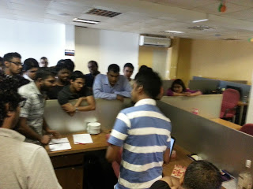
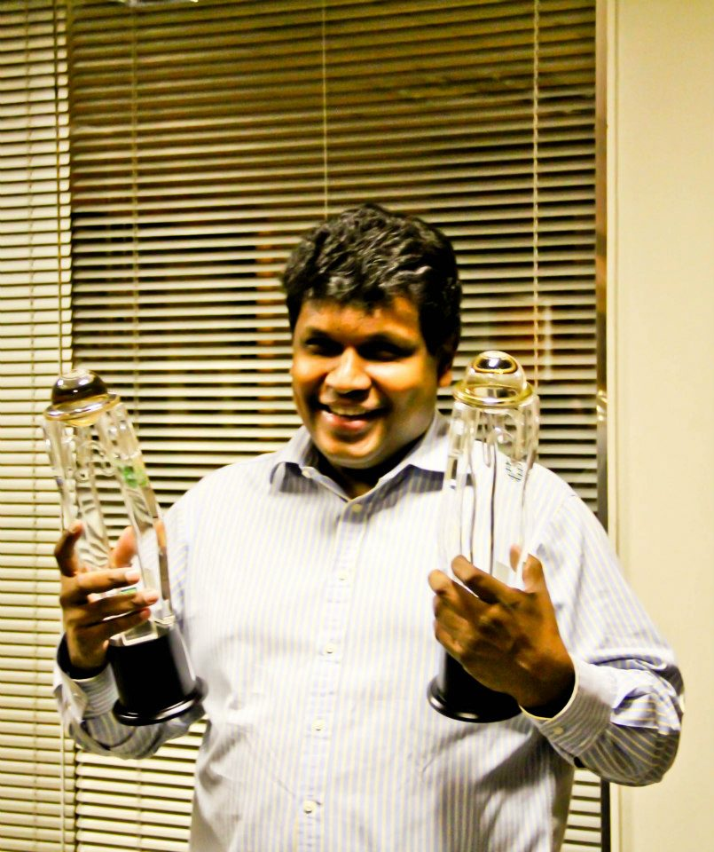

Time has gone extremely fast, and I can still recall the day that I joined Duo. I can safely say that Duo is an awesome place to work at since I have had the opportunity to work with awesome, highly motivated people who loves the company. I never had much trouble with work life balance as I only worked more when I felt like it, rather than someone telling me to do. It truly is a different experience working for a Product Company which gives you an environment (Innovation engine) and Core focus on developing cutting-edge components.

  

  

Unlike most of the top IT firms in Sri Lanka, Duo gives  much importance to innovation and out of the box thinking. If you have something new and substantial to offer, trust me you are going to go a long way. It is a great place to start your career. Work culture is very positive and is full of energy. Talents are recognized and appreciated. Most importantly, one of the places which gives importance to work life balance!

  

**Why I think it’s a great place to work?**

**Flat Hierarchy and Freedom of Ideas:**  

One of the things I love about Duo Software is that there's no sense that management is hiding somewhere making decisions and then condescendingly telling you what to do without listening to input. From CEO to the person who provides tea is constantly asking for input from everyone in the company and is available for discussing where we should go. It is a company, still at a size where you can get to know everybody and things still feel like a family. And it's exciting to watch the company itself evolve and grow.

  

  

  

**Great Learning:**

Duo Software has a lot of smart, hard-working people. The best engineers I have ever had the privilege of working with. For developers out there it’s a company that uses “GoLang”, a fun new language, as well as Couch Base, Redis, AngularJS and a range of other cool new technologies that will be good to know for the rest of your career.

Here at Duosoftware,

**“Developers don't need dress code,**

                                          **They do write best code!”**  

**Awesome office:**

Some heavy metal music to keep you awake, a pool table which is free to be used by the team whenever they like, a reception hall with a pretty receptionist, a group of crazy people from different places belonging to one family. What more  could you ask for?  
  

  

**More Opportunity and Responsibility:**

As of my knowledge, DuoSoftware is producing an exciting product that is constantly evolving and exploring the cutting edge, thereby a developer can become a full professional stack developer.

  

**The Best “CEO”:**

Last but not the least, one of my inspirations Mr.Muhunthan Canagey. As an aspiring tech entrepreneur, I think his best asset and what led him to success was being optimistic. He sees the problem in many perspectives and he thinks of solving the problem in many dimensions. An outstanding human being, that any employee  would be proud to to have as CEO.  
  

  

  

  

Finally, my journey with Duo Software is remarkable, and I hope the upcoming days will be equally fulfilling and challenging, towards my next goal. I hope this blog will also serve some help to new members of team Duo  or laterals willing to join Duo Software.
