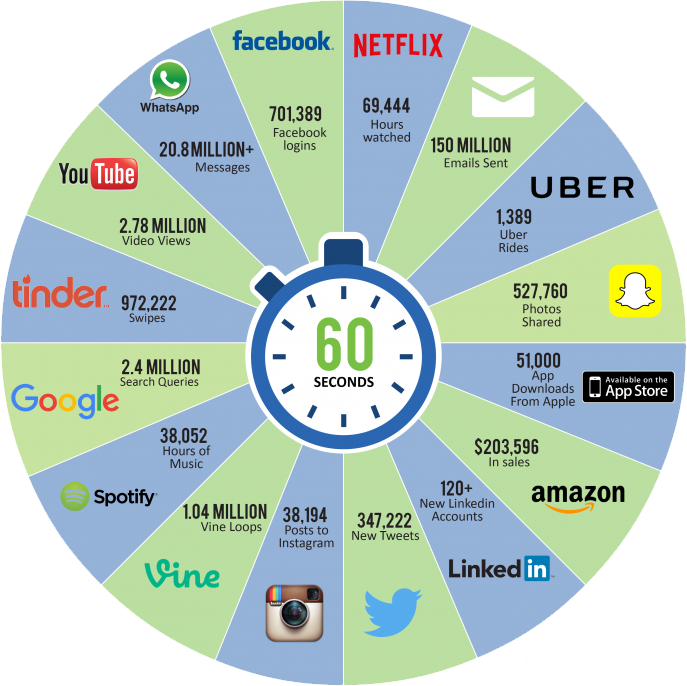
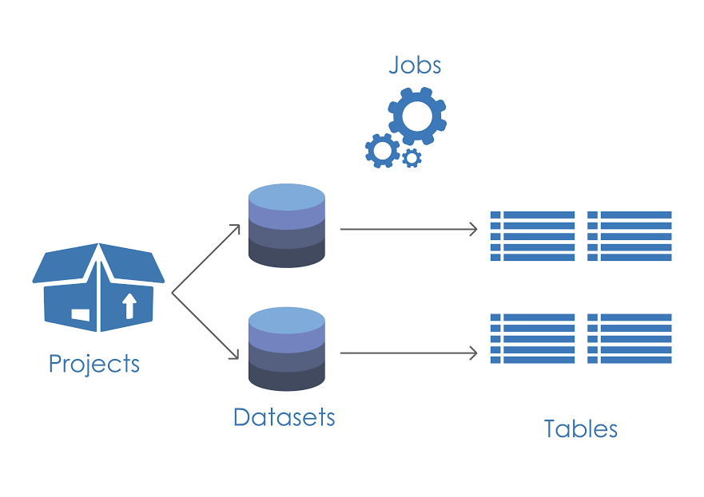
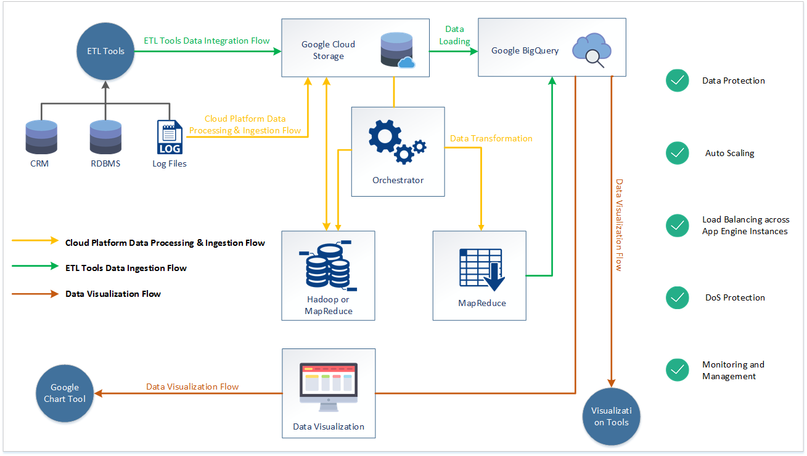
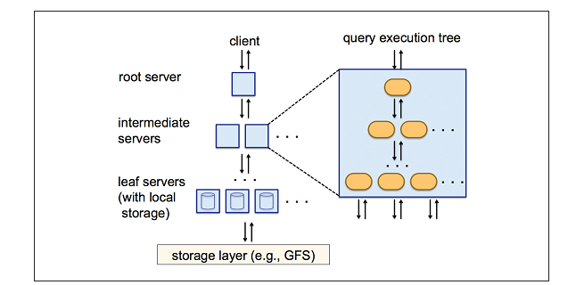
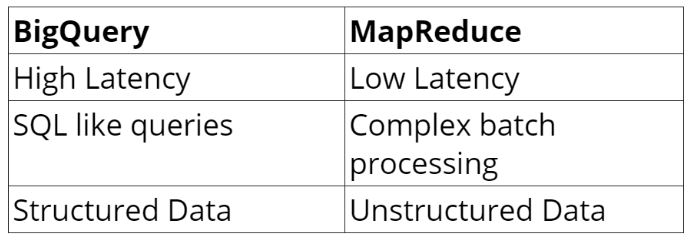
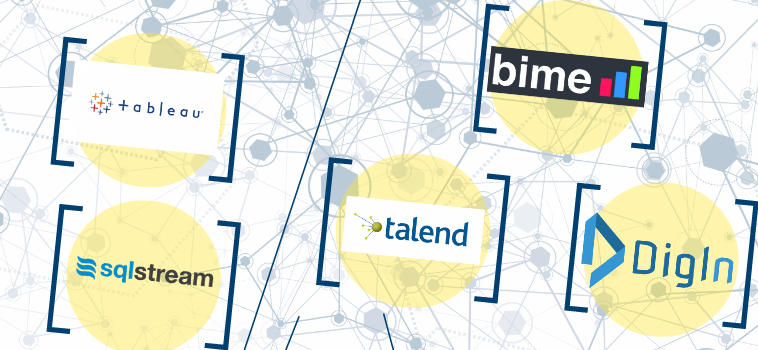

Well, i was one of the speaker at Colombo Big Data Meetup which was held yesterday and i spoke about Google's bigquery. Hence i have decided to write a blog on that so that you could get benefited if you are a BigData Fan.  
  
**What is Big Data?**  
  

There are so many definitions for Big Data , let me explain what does it really mean? In the near feature, every object on this earth will be generating data including our body.We have been exposed to so much information everyday.In vast ocean of data, complete picture of where  we live where we go and what we say, its all been recorded and stored forever.More data allows us to see new , better different things.Data in the recent times have changed from stationary and static to fluid and dynamic.we rely a lot on data and thatch is  major part of any business.we live in a very exciting world  today, a world where technology is advancing at a staggering pace, a world data is exploding, tons of data being generated. 10 years before we were measuring data in mega bytes, today we are talking about data which is in petabyte size, may be in few years we are going to reach zetabyte era, that means the end of English alphabets.Does it means the end of Big Data? .No . If you have shared a photo or post or a tweet on any social media,You are one of them who is generating data, and you are doing it very rapidly.

  

Once you have decided to use bigquery there are certain things you need to know before using for optimizations and less cost.

  

**Do not use queries that contains Select \*** , which is going to execute entire dataset and hence it will result in a high cost.

Since bigquery stores values in nested fields it is always better to **use repeated fields.**

Store in multiple tables as possible since it is recommended **not to have JOINS**

Bigquery also supports extensions such as **ebq** and **dry run** to encrypt the data and for executing the query to actually check how much resources that actual query is going to consume, which makes lot of developers and data analysts job easy.

  

I will be writing two separate blogs in the coming days on how to integrate with Bigquery and How to ingest the data into bigquery.

  

You can find the slides of the presentation from [here](https://prezi.com/nh-yck4m6kkw/digging-into-bigdata-using-bigquery/)
