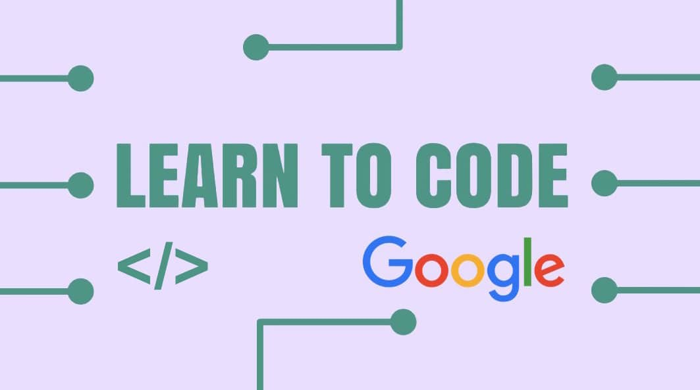

It has been 6 years since i entered into programming field, and 18 years since i started using a computer, Everyone things i am a computer geek. Some times in my mind sounds come that Is that I am really a developer or just a good nethead?.

  

It's because there has not been a single day i coded without using Google search and Stack Overflow.

  

  

**My Experience**

  

When I was 15, I wrote my first program.  That was a long time ago now.  And it was in pascal language. During my university days i had more interest on gaming and animation rather than programming. When i got my first job, i struggled to code in c# with the dot net platform  during the initial days. With the help of google and stack overflow, now i would rate myself 8 on c# and i have experience of various open source technologies. But still i felt i was a better googler , not a good programmer. 

  

**What made me to think I am a really bad programmer?**

(i) Choosing workarounds over doing the right thing.

(ii)Used Ctr+c and Ctr+v more than normal keys

(iii)When things went wrong, i asked **who** is at fault rather than **what** the problem was. **

**Mistakes to avoid to become a better programmer**

**

In the year 2016, i started to avoid above practices and i would say programming is the first step to solving problems using technology. My tips that i followed during the year to be a better programmer as follows,

  

  
  

- Every day find a small challenge that can  be done in an hour.
- Read code. There is a plethora of freely available code for applications. There are tons of free projects by others on github.
- Make small projects to build experience.  Make it an open source project and if you can encourage collaboration if your project is compelling enough.
- Try programming for a day without googling. continue it for two days, maybe a week. See how it feels.
- Go to Meetups, Workshops, meet with others who feel the same way you do about technology.

  

  

anyone can become a good developer if he/she is passioned about it and practice a lot, preferably daily."In order to remain at the same level you have to spend at least two hours daily programming.". There will be many programmers out there who would think the same! What do you think?
