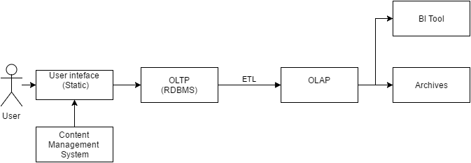

Let me start this blog with a little example. Assume, Sachin have a leak in a water pipe in his garden. He takes a bucket and a some sealing material to fix the problem. After a while, he see s that the leak is much bigger that and he needs a specialist  to bring bigger tools. Meanwhile, he still uses the bucket to drain the water. After a while, he notices that a massive underground stream has opened and he needs to handle millions of liters of water every second.   
  
He does n't just need new buckets, but a completely new approach to looking at the problem just because the volume and velocity of water has grown. To prevent the town from flooding, maybe he needs his government to build a massive dam that requires an enormous civil engineering expertise and an elaborate control system. To make things worse, everywhere water is gushing out from nowhere and everyone is scared with the variety.  
  
Welcome to Big Data.  

  

  

**Key elements of Big Data:**

  

1. There are over 600 million tweets every day that is flowing every second which tells about the **High** **Volume** & **Velocity**
2. Next  need to understand what each tweet means - where is it from, what kind of a person is tweeting, is it trustworthy or not which tells about the **High Variety**
3. Identify the sentiment - is this person talking negative about iPhone or positive? which describes about the **High Complexity**
4. And finally need to have a way to quantify the sentiment and track it in real time which tells about **High Variability**

Traditional architecture of any Big Data solution would look something like below,  
  
  

