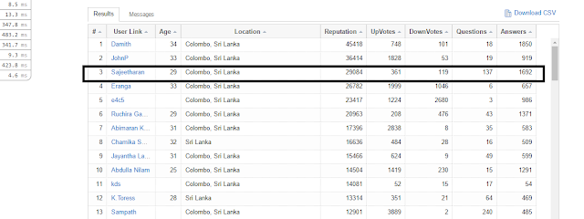
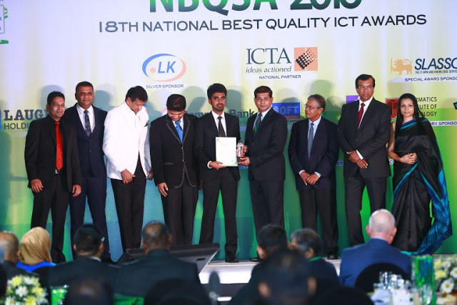

Year 2016 turned out to be awesome for me! A very slow start of the year with lot of challenges somehow accelerated into very convenient series of events.  
  
**Top 3rd user in Sri lanka on Stackoverflow:**  
  
  

  
I’m an addict about Stack Overflow for an year now. Before I start my work at office,or before i goto bed,or on a break,during lunch, Stack Overflow comes to my mind. I have few reasons because,  
  
**Willigness to learn:**  
Learning never stops, for sure. Every day, a new way to solve a problem coming out and Stack Overflow is a great way to be informed about them.  
**Willingess to teach:**  
It also increase your “writing” ability and teaching you better about the information that you think you already know.  
**Reputation and moderation**:  
Stack Overflow's model has made answering interesting with reputation, badges, privileges, leagues and stuff. And the community is too good. The people I know from Stack Overflow, are real good and are very friendly.  
  
All the above reasons made me to be an addict on stackoverflow and made me to the top 3 users in srilanka with the reputation over 30k.  
  
**Became a lead and product owner**  
One of the life time achievement during the year was becoming an product owner and a tech lead. I got an opportunity to build a product of my own and leading a team of 10 members, and the things i learnt were countless. Working on a distributed team has many challenges but it's a very rewarding experience.  
  
**Got married to the person i truly loved**  
It feels amazing when you get married to the same person you loved for 10 years. But  it didn't come without some degree of effort, empathy, compromise, and sacrifice. Now, it's nice when the love and sacrifice comes easy, because you're so enamored and amazed by the person you are with, falling in love. It takes little effort. But the real rewards come from fighting through the tough times.  It's actively building something together, something you can be proud of, and want to protect. That happened to me during the year 2016. 
  
  
**Got National level award for the product**  
There is a top-secret recipe for success. Keep this secret mantra: "Work Hard".Another best thing that happened to me during 2016 was getting the merit award from NBQSA. It feels great when your hard work has been paid off. Later, the appreciation from the company and the CEO was one of the highlights of the year.  

  
  
Finally, I could write a book on the year 2016 . The most of the good things had happen to me.Something I have prayed about all my adult life . I feel am so blessed and the search is over  for the year 2016.Now, the new year 2017 has arrived. Wishing all of you a very happy and prosperous New Year 2017. May this year bring joy, happiness and peace to all of you.All excited and looking forward to another challenging year of good work, positive vibes and exclusives
