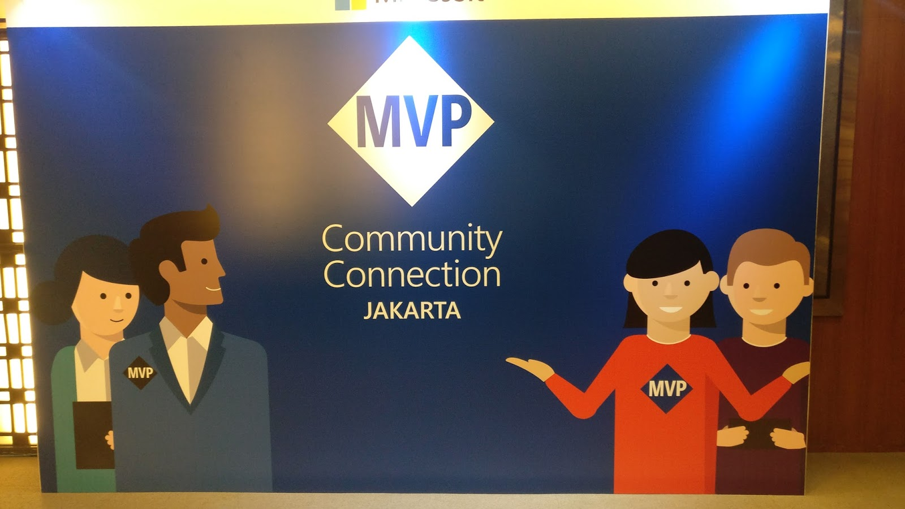
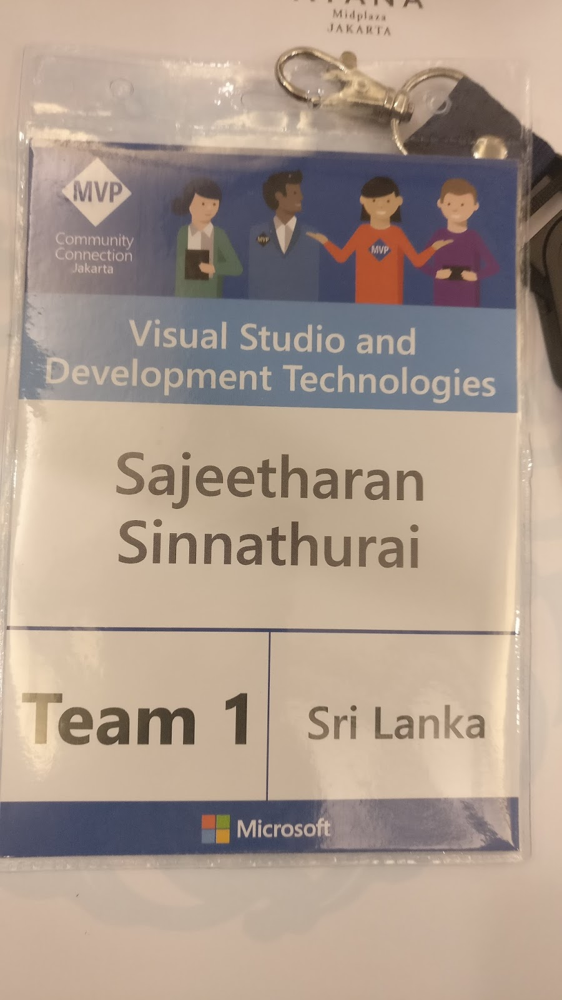
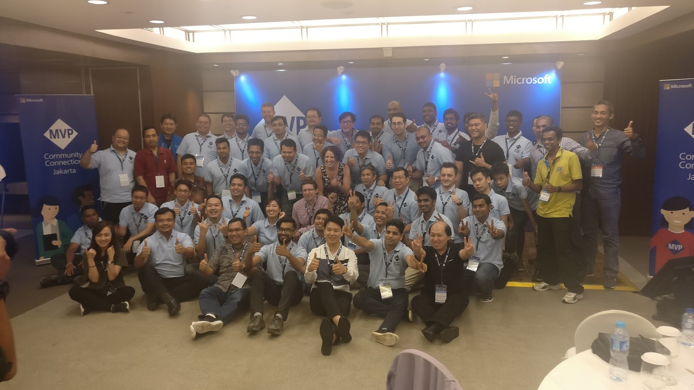

It was my first ever experience to participate in Microsoft's event outside Sri Lanka. My experience as a “first-timer” attending the South East Asia's MVP community connection, along with few other MVPs from my country. MVP Community Connection is a day to connect, learn, inspire and celebrate the local MVP community and MS employees.

  

  

  

  

It was an exclusive event especially organized for Asia pacific MVPs. The intention is to have all MVPs from different region join there and have a great time with others. There were some interesting sessions and networking between each other. 

  

From the moment I got off the plane at the Soekarno–Hatta International Airport Airport, I was very excited about the event. I was the first to arrive AYANA Midplaza JAKARTA 2 hours prior to the event. From the registration, greeted by Microsoft mvp tshirt and  I was escorted to pick up my personal registration badge and Wahoo!. 

