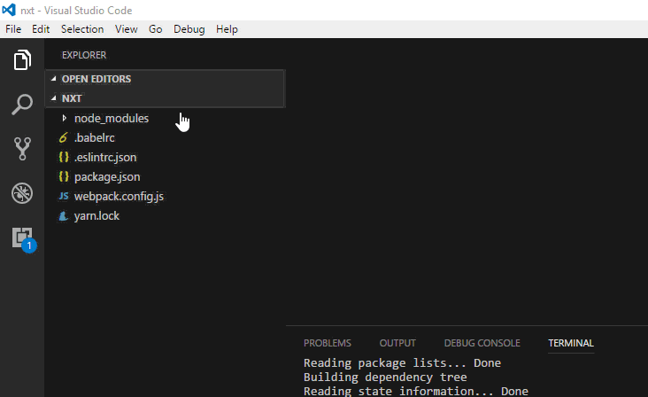
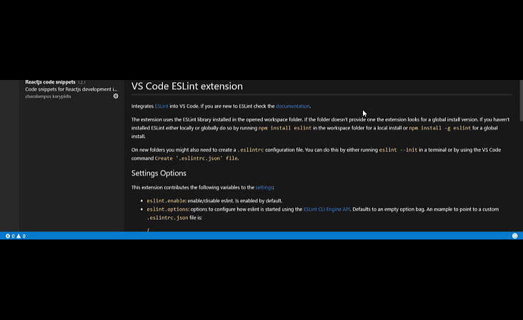

Poor code quality application can lead to many serious problems when the size of code grows. **Linting** is the process of checking the source code for Programmatic as well as Stylistic errors. This is most helpful in identifying some common and uncommon mistakes that are made during coding. To do this process many linters are out there like eslint, jshint, jslint etc.    
  

  
  
  
  
  
  
  
  
  
  
  
  
  
  
  
And if you want to explore more on ESLint you can explore it on the website http://eslint.org/
