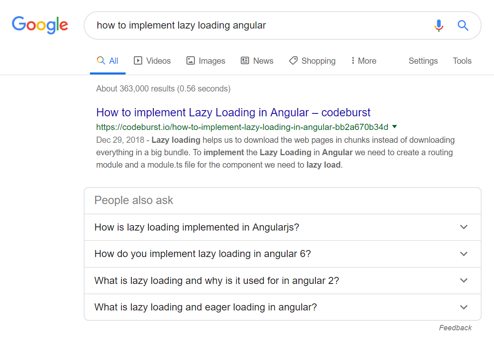
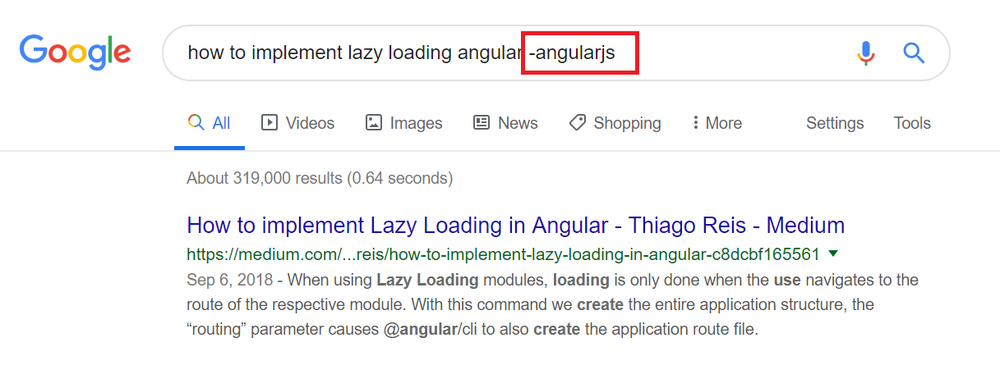

This tip is for Angular developers, whenever you are stuck with an issue on Angular you search something on google for angular, it will end up showing the results with angularjs(1.x) aswell.

**Normal search**

To avoid this, you could simply do the following , add “ **-Angularjs“** to your search query

It Will return only the results which matches angular. This will seriously improve the productivity and help rapid development.

Spread this tip across your Colleagues,Friends,Enthusiasts.

Spread this tip across your Colleagues,Friends,Enthusiasts.
