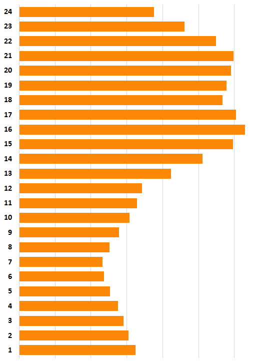

It's been so long since i wanted to write a blog on how to contribute on stackoverflow. Recently myself and one of my colleague had a small session on the same topic and i decided to share the experience in this post and this is a good opportunity to address some misconceptions about Stack Overflow.  
   
let's dive into the world of stack overflow.  
   
Programming became a lot easier these days when you could just type a question into Google and it would find that someone asked the same question in stack overflow. Stack overflow offers helping hand to all developers out there. When it was started in 2008 by  
Jeff Atwood and Joel Spolsky one of the aim was to have a repository of great questions and answers. It revolutionized the way of quesitioning and answering should be. The main reason for success of stack overflow is **accountability**.  
   
It's managed by the community and community keeps the environment. For example, if you post some bad video on youtube it still spreads over the world and even if you want to remove it it takes number of days and you have to go through lot of process. In case of stackoverflow there is always a guarantee that good content is always delivered and maintained.  
   
It has multiple features embedded. It has the various concepts which are similar to,  
 

**Wikipedia** - Answers/questions are editable by anyone once you reach level of repuation  
   
**Digg/Reddit** - It has the same ranking system in the form of reputation so that the best content rises to the top  
   
**Forum** - Similar to any kind of forum, it has the feature to comment on someone's question or answer.  
   
**Blog** - Blogs can be embeded as links inside the answers so that you could get more visitors to your blog.  
 

There have been around 7 million active programmers ask and answer the queries related to programming on stack overflow. It is a better reflection of what you do professionally. For any programmer answering and asking questions on stack overflow is a great learning method.  
   
Lets see why do you want to contribute to the community via stack overflow. As a programmer you have the responsibility to give something back to the community. You got to learn from everyone everyday which makes you a better programmer. How do you make you a better with the help of stack overflow  
   
(i) You read awesome code by others  
   
(ii) You get the feedback from other awesome developers on your code  
   
(iii) Competition factor (reputation and ranking) which automatically drives you to learn.  
   
Being an awesome programmer will automatically make people to have an eye on you.

### How to start if you are new to stackoverflow?

Starting with stack overflow is once  again a bit of hard task which is similar to owning a startup where reputation that you earn is the investment.

### Tips:

#### (i) Set up a good but short list of Interesting and Ignored tags

It is one simple tactic that you could follow to start answering questions, say if you are interested in answering angular questions, you can filter the questions with the tag angular and it keeps getting updated in the time line.  
 

#### (ii)Try answering at a time of day or day of week when there are fewer users on Stack Overflow and presumably less competition for answering questions.

According to the following graph, It appears that  heaviest users on stack overflow are from North America as seen here so the lightest times are when North Americans are sleeping. Try answering the questions at that time. 

#### **(iii) Earn your initial reputation by asking question:**

One simplest way to earn your initial reputation by asking question and accepting the answers which would give you a reputation of 2 and if the question is really good you will be earning a reputation of minimum 15. One common mistake the newbies tends to do is not accepting answers. Always make sure to mark the correct answers.

#### (iv)Rubber duck debugging:

Asking question and answering yourself is one of the best way to start your initial account on stack overflow.

Lets see, How to ask good questions?

There is already FAQ section, but i would like to share my experiences on how to ask a good question.

It should be precise - The questions should not be too broad or too small. It should be very precise. A good question for example,

> `i tried x and here is my code it does not work and i cant figure out why, here is a piece of code you can reproduce the problem which makes a great question.`

Proof-read before posting a question - Do a little bit of research on the question that you are going to post if it already exists in the site and be clear on it.

- [Codepen](https://codepen.io/)
- [JSFiddle](http://jsfiddle.net/)
- [DotNetFiddle](https://dotnetfiddle.net/)
- [Plunker](https://plnkr.co/)

#### Include all the relevant tags:

Always include the relevant tags with the questions which makes to get answers easily and to filter.

#### Don't post a question and run away

One of the common mistakes i see with the new users is that there is no response if there is any further clarification, it is always better to wait for the first interaction which makes answers to come easily.

#### Format Question

Always format your question with the for matter so it is easy for others to get a clear idea.

Next, we will see on How to Write a better answer for the question?

Writing answers is the best way to earn your quick reputation on stack overflow.

#### **How to Write a better answer for the question?**

Writing answers is the best way to earn your quick reputation on stack overflow.

**(i)Minimum viable answer** - To earn your reputation fast, start with a minimum viable answer it should be working and properly formatted.

**(ii) Iterate it :** Always try to iterate the answer by adding step by step instruction , explain what does the code do. Also attach a working example code snippet with high level description of concepts. You can also use some of the following tools to attach the demo with the answer. Best way is to use the existing code editor to show the demo or proposed solution. I will be writing a detailed blog on the same.

**(iii) Give credits to the author:** Whenever taking an answer from blog or an existing stack overflow answers, give credits to the author by adding the link. Always include the content inside the link rather than just adding the link, which would stay forever even if the link is removed later.

#### Earning Reputation and Badges:

Reputation is rough measure of how much community trusts you, communication skills, quality of your questions and answers. The more reputation you earn the more the privileges you get.

**Up votes and Down votes:**

If you want to thank someone up vote, mark as answer. If you see good questions that really helps others up vote them. You can read more about reputaiton and how it works. Always try to upvote the best answers so that it goes to the top.

Always take down votes in a sportive manner, down votes are not for demotivating or stopping you from answering, it's a hint for you to make the answer/question better and don't take it personally.

You should not specicically try for getting the badges, because it comes with the reputation which you gain from your experience. Even though there are some badges which you can try intentionally.

- Self learner - Answering your own question
- Autobigographer - When you fill all your details in your profile. Here is an example.
- Analytical - Visit all fields of site FAQ
- Critic, Supporter , Editor - when you first down vote up vote and do your first edit
- Student or teacher - Simply answer and get 1 up vote
- Commentator - After you leave 10 comments
- Promoter and investor - when you offer some reputation to other users

#### Best practices:

**Don't be in a hurry**  
One suggestion is to start in the list at between 6 hours to a day old questions if you are looking for particular questions on specific technology using filters. Questions that are old, that shouldn't be answered, have likely already been downvoted. So that can help you filter what to answer until you get more experience.

**Pick questions that will stretch you**  
In general you will not get as much reputation on older unanswered questions, but you can get practice answering questions, and since there is little rush to answer, you can pick a question that will take more research, and you have the time to go figure it out.

**Don't answer poor-quality questions.**  
In general Before answering a question, do a quick search on the title of the question, and then using other related search terms that might turn up an identical question. Too often, a question is asked which has already been answered before, sometimes many times before. Vote to close or flag such questions using the "duplicate" reason, rather than posting yet another answer.

Make sure the question is clear and unambiguous, concisely stated, and contains a useful code example (most questions really should have a full Minimal, Complete, and Verifiable code example). If you have enough reputation, edit the question to improve it so that it meets those standards. If not down vote it.

It's always helpful to post a comment under the question to encourage the question's author to improve their question, explaining precisely how they can do so. Sometimes, this can be all it takes to help a question poster get their question on the right track.If this doesn't help, then you can flag posts that need to be closed, an ability you unlock at 15 rep. This is a great way for low rep users to help get questions closed. For example, if you find a duplicate, even if you can't vote to close you can still flag the question. This will leave a comment linking to the other post and will put the question in the Close Vote review queue for others to see.If you don't have enough reputation to post a comment, focus on other activities that will garner you the necessary reputation points (for example, answering other, high quality questions or editing posts that could use some help).

## Things to Avoid :

We have seen how to do things in the right way, In eager to gain more reputation lets see what are the things that you should not do. Here are a few things that could quickly get you into hot water, but are common mistakes:

#### Do not undo useful edits:

You would be surprised how many users get angry when their posts are edited! If you don't agree with an edit, you can undo it.However, if someone edits your post to completely change the wording, change your coding style, or otherwise change what your answer says, you are more than welcome to undo that edit.

#### Do not post a comment in the answer box:

This may seem self-explanatory, but a lot of people do this. Writing any form of "I don't have the rep to comment, so I'm posting this as an answer" does not excuse this act.Long story short, just don't do it. If you don't have the rep to do something, then don't try to workaround it please. Your post will be deleted at best, and you'll have angry users to deal with at worst.  

#### Don't post just a link to answer a question:

Stack Overflow is meant to be a high-quality repository of problems and their solutions. To accomplish this, we like to have posts be as self-contained as possible.If you link to a tool/plugin/library that will solve a user's problems, great! But please, explain why or how that tool helps. Even better, show how, if possible, to use the tool to solve the problem. A brief code snippet showing how to use a library, for example, or the function the user needs to call and how to incorporate it takes a low-quality or average answer and helps make it a good answer.If you're linking instead to documentation or a blog or such to help explain something, quote the relevant part of the page and explain in your own words how it answers the question. If the relevant part is the entire linked page, summarize it as best you can and explain how this helps.

#### Don't plagiarize:

To meet the last point, you might decide to just copy and paste large parts of pages to your answer. Don't do this! If the section you're copying is large, try to summarize. Always provide a source to the page and give proper attribution. Put anything you quote this way in a blockquote. Hit the quote key on the toolbar, or insert a > before each line of the quote. If you are quoting another answer on Stack Overflow, check if the questions might be a duplicate of each other. If yes, flag one of them as duplicate of the better one.

#### Don't post images of code or text:

This might also seem like a no-brainer, but a lot of people do this.Posting images of your code, error message, console output, etc. make it harder for your post to be found through searches, or for readers to paste what you have presented into their editor window. It also makes things much more difficult for users with screen readers.If you can't copy and paste, it's far more preferable to hand-type anything you can. If an error is long, try to post the most relevant part of the error and not the whole thing.

####   
Don't try to be the fastest gun in the west:

A well thought-out answer that takes longer to write is better than "Try this" followed by a code dump. Posting an incomplete answer so it gets seen first can lead to down votes from users who don't find it useful, even if you intend to improve it with later edits.

#### What is #SOAReadyToHelp?

Most of the high reputation profiles in Stack overflow will have the above tagline.It was a contest from 2015 to celebrate the [10 million questions](https://meta.stackoverflow.com/questions/303045/10-million-questions-lets-share-some-stories-that-the-number-doesnt-convey) in Stack Overflow.Users were asked to share the experience about Stack Overflow in Twitter with the #SOreadytohelphashtag. So if you are new to stack overflow add it in your profile.

Finally here is the video on the session [Stackoverflow Tricks/Tips](https://www.youtube.com/watch?v=Pf9rWCwRTrY&t=265s)

I will be writing a separate blog on advantages of being an active user on stack overflow and its benefits. Well those are some of the tricks that you can take from this blog to gain more reputation on stack overflow and more importantly you got to learn and share your experience and contribute to the community. Happy contributing!
