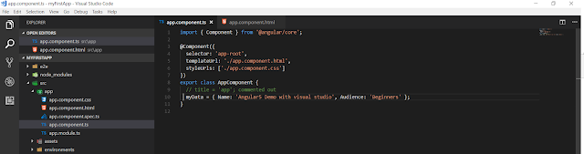

My first post for the year 2018 and i wanted to write something about a technology in which i have vast experience and passionate about. This blog will be very useful for those who want to start with angular for developing web applications.In this blog i am going to set up Angular 5 app using Visual Studio Code. I will be using Angular CLI for our sample application. The following are the steps needed to create your first angular application using angular5.

**Steps**

- **Install Node.js.**
- **Install Angular CLI.**
- **Design our  Angular App.**
- **Launch  App in the browser.**
- **Displaying our custom information on a page.**

**1\. Install Node.js**

In this approach, the first step is to install Node.js. If you have not installed nodejs in your machine visit the website and download according to your OS. You will see the following display.

Download and install the latest LTS version as per the configuration of your machine. The current version of Node LTS is 8.9.3. Installing node.js will also install **npm** (node package manager) on your system.

Next step is to make sure everything related to node is installed, To check the version of node and npm installed on your machine, run the following command in command prompt.

- **node -v** 
- **npm -v**

which will be as follows,

**2\. Install Angular CLI**

We are done with the step1, next is to install angular cli. For those who are very new to angular , [angular cli](http://ngcli.github.io/) is a command line interface for angular applications. After installing node and npm, the next step is to install Angular CLI. Run the following command in a command window.

- **npm install -g @angular/cli**

The above command will start Angular CLI installation on your machine. This might take bit of time  based on the internet connectivity.

 

 

 **3. Design our  Angular App.**

That's all folks, we have setup the necessary environment to start coding. Lets create our application in a folder named Angular5Demo. Run the following command to create a folder for our application.

- **mkdir Angular5Demo**

lets navigate to our created folder, so run the following command.

- **cd Angular5Demo**

we are in the same folder where our application resides, so lets create our template/structure for our application using angular cli. run the following command

- **ng new myFirstApp**

if you have missed anything the following screen shows the steps and the output.

Lets see the code in visual studio code editor. Type code. in the command prompt.

- **code .**  

Which will open up the code in the visual studio code. And that’s it.  You can see the following file structure in Solution Explorer. We have created our first Angular app using VS Code and Angular CLI.

4. **Launch  App in the browser**

 To launch the application and to start the web server run the following command 

- **ng serve** 

**After running this command,** you can see that it is asking to open _**http://localhost:4200**_ in your browser. So, open any browser on your machine and navigate to this URL. Now, you can see the following page.

We'll leave the web server as it is while we look into the code of this application. Again open the code inside the path by typing the foolwoing command.

      **code .**

5. **D****isplaying our custom information on a page.**

Now, Let's display a message saying "" using JSON data on the page instead of the message “Welcome to app!”. To achieve this, open **_/src/app/app.component.ts_ file. Change it as follows or according to the data you want to see on the page.**

and HTML template as,

Change the value of title property to a JSON object as shown above.  You can see the updated web page as shown below.

With angular cli If the web server is running and you make any changes in the Angular application, then you don’t need to refresh the web page. It will automatically update itself as you save the application code file. You can now play with the appellation by using various JSON objects also by making requests.

That's it folks, we have learned about creating our first Angular 5 app using VS Code and Angular CLI. Please post your valuable feedback in comments section.
