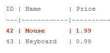
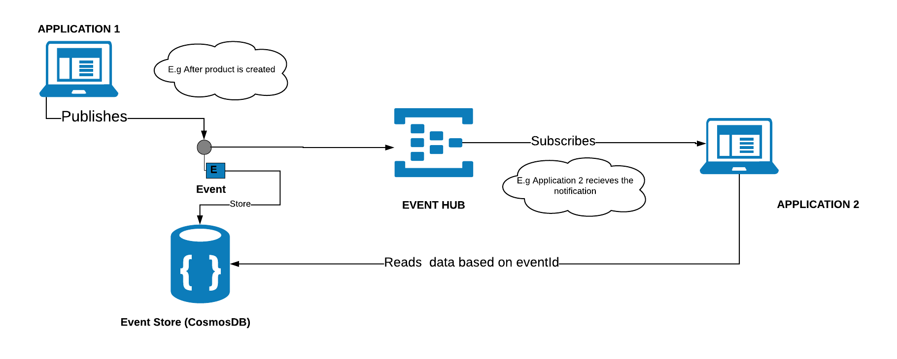
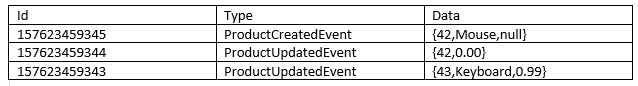
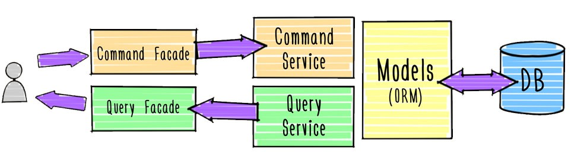

### **Traditional Architecture :**

In a traditional Application with the normal approach, transactional use-cases usually involve persisting data in a few SQL tables or in a NOSQL database. When the changes are performed on the object the database is updated to match the new state.

The traditional approach works well in case if you do not need to know the changes that object has gone through, but in modern systems customers always comes up with a requirement to get the log of changes that particular entity has gone through. With the traditional approach, there is no way of knowing what the user had in the object before changing it, or at which point of time the contents changed. We can still solve this with the traditional way by storing the extra information about the modifications but the solution becomes more complex.

For example in traditional approach,

https://gist.github.com/sajeetharan/2d9921571c67f7038ec5a4053882b85f

Which will create an entry for each insert in the SQL database as follows,

The current state is saved in a relational database. We load the object, change it and save  it back.

### EventSourcing Architecture :

In the eventsourcing solution, we look at the problem as a sequence of events that occur and save the occurrence of events as it is. The events contains all details about what actually happened at particular point of time. These are historical information and once it is saved it should not be modified.

https://gist.github.com/sajeetharan/825ec83fd780b7670146649bf6d4a0ce

All events for a certain product are stored. Their data and sequence define the current state of the product. Event is the easiest way to remember what happened at a certain time. Event sourcing comes with an advantage of having audit trail by itself and to get full understanding of what the system is doing.

**Event Sourcing Architecture with AzureCosmosdb and EventHub**

To implement event sourcing in your application, Microsoft azure provides the following services to  full fledged solution and we will discuss in this blog.

Lets look at the diagram below,

Application 1 stores the data in the traditional database and your customer needs the changes that has been done on the product. The above architecture will easily fulfill the requirement with the event sourcing.

Components involved in the architecture as follows,

### Azure EventHub

Azure Eventhub is a managed service to receive and process millions of events per second. It is intended to handle event based messaging in huge scale. This could be used in an product if you have devices application publishing events and send them to eventhub. It will create a stream of all these events which can be read by different applications in different ways. Eventhub provides interfaces such as AMQP and HTTP to make it easy to send messages to it. In Eventhub we can define consumer groups which lets us to read stream of events. We can decide on consumer group based on the number of receivers(applications)

#### **CosmosDB**

Azure Cosmos DB is a globally-distributed, multi-model database as a service build for low latency and elastic scalability.  It supports the following options to store the data and it is highly available from anywhere in the world,

- Key-value
- Column-family
- Document: MONGO or SQL
- Graph

I will be not going in detail as there are enough blogs to get started with CosmosDB. In the above architecture there will be millions of events created after each update hence we need to store them in the cosmosdb with the state of the object. This way brings a lot of benefits. First, the event store with cosmosdb becomes your canonical source of truth that describes the updates applied to your domain in an unbiased form.

**Implementation:**

**Application 1:**

Whenever user updates an object in the application1, there will be notification message sent to the EventHub with an ID (unique id for each message) that something has happened on application. We could make use of epoch timestamp with 8 digits to make sure it is a unique one. A sample payload would look like,

`{"MessageId": 1547632386819}`

**Note:**  As Eventhub can have a message of maximum size 256k it is always better to have minimum size of message.

Once the notification is sent, the state of the object is stored in the eventstore(cosmosdb).

**Application 2:**

Application 2 will have an EventHub receiver which runs on the background which will subscribe to the EventHub and get the latest message. Once the id is retrieved by the receiver, it can request the eventstore with the id and get all the changes prior to the id as follows,

https://gist.github.com/sajeetharan/c34965a606c8afff9d02f2a3a17522bf

which will create the documents in Cosmosdb as,

With the above approach ensures that all changes to product are stored as sequence of events. When we look at broader picture, it also ensures that all changes to application state are stored.

This is the simple architecture diagram to implement event sourcing in your application. One of the very good pattern to implement event sourcing is by using CQRS(Command Query Responsibility Segregation).

Lets look at the etail implementation with the code in the upcoming blogs. Hope this will help someone out there to implement event sourcing in your application if you are using Azure platform.
