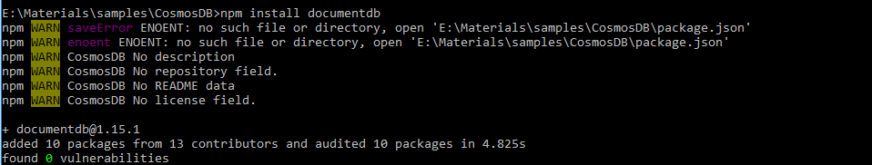

I have been working with couple of applications built with CosmosDB and one of the things that surprised me was one cannot clear all documents in a collection from the [Azure web portal](https://azure.microsoft.com/en-gb/features/azure-portal/) or using the [Storage Explorer](https://azure.microsoft.com/en-us/features/storage-explorer/). As I was struggling to do this while doing some tests on the application I decided to write a blog on the solution I used. There are two ways to achieve the same

- **Using a stored procedure**
- **Using Cosmosdb SDK**

#### Using Cosmosdb SDK:

I came up with a script in Node which can be done with any of the programming languages such as C#,Python supported by the SDK

Let’s go through the steps:

**Step 1:**

Open VScode and Create a file named [cosmosdb\_helper.js](https://github.com/sajeetharan/cosmosdb_helper/blob/master/cosmosdb_helper.js)

**Step 2:**

Let’s install the necessary packages needed.

Install **documentdb** javascript **sdk** with the following command,

**npm i documentdb**

and you will see the output as follows

Let’s install **require** to handle the dependencies with the following command,

**npm i require**

and you will see the output as follows,

**Step 3:** 

Let's do some coding. You will be able to understand the following code with the comments added on each line,

https://gist.github.com/sajeetharan/8efe2c9424dfc89d1f58b34627858944

Suppose if you have partitionKey created with your collection, you need to pass queryoptions with the partitionKey in selectAll as well as deletDocument as follows,

https://gist.github.com/sajeetharan/d5302257d3b5e54a33e5601b215decf1

**Step 4:**

Let’s run the script and see the **output**,

You can run the helper script as follows,

if you want to **list all** documents in the collection,

**node cosmosdb\_helper.js selectAll**

which will list the output of all documents in the collection.

If you want to **delete all** documents within a collection, you can run the script as,

**node cosmosdb\_helper.js deletAll**

which will remove all documents in the collection.

#### **Using a stored procedure:**

As mentioned above, 2nd way is to use the stored procecure given by Microsoft employee as mentioned [here](https://github.com/Azure/azure-cosmosdb-js-server/blob/master/samples/stored-procedures/bulkDelete.js).

Hope the helper script will help someout out there in order to delete all documents in a collection. You can get the whole code from [Cosmosd\_Helper](https://github.com/sajeetharan/cosmosdb_helper)
