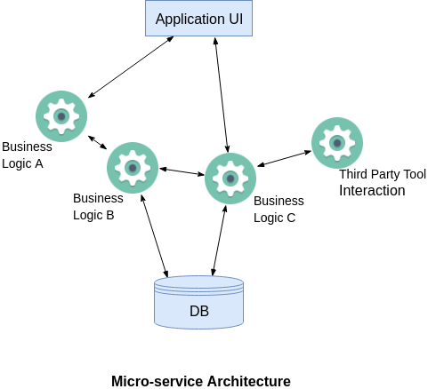
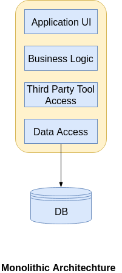
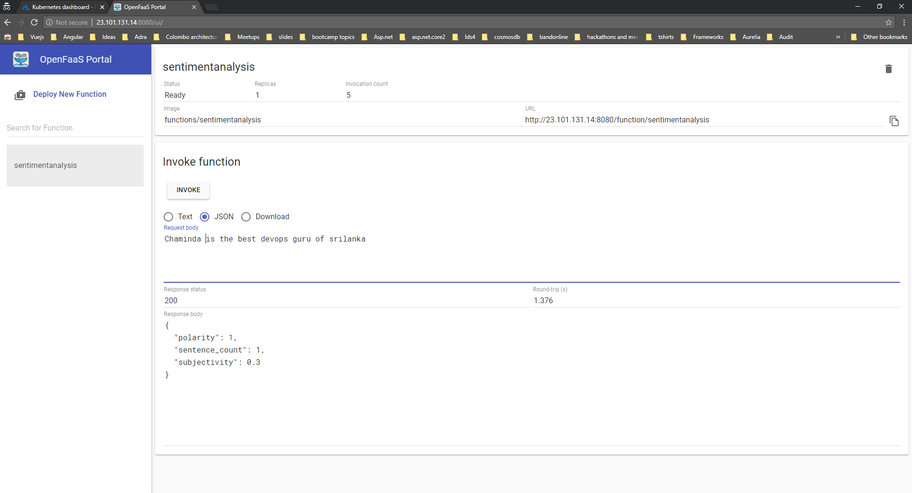

For the past one month , I have been experimenting with one of the promising serverless framework for creating serverless functions.  With the modern applications moving to cloud with microservices this framework becomes very handy to create/manage your microservices in the form of functions.

## What do we need microservices?

When I started my career as a developer most of the applications that I worked on are with three Tier architecture and most of the companies built the applications with monolithic architecture even before cloud platforms were existed. With the modern technologies everyone is decomposing the business functionalities of the application into several micro services to avoid single point of failure. Assume Uber as an application and their core functionalities such as Registration,Payment,Email notifications, Push notifications could be broken down to several microservices in order to avoid any downtime. With monolithic architecture single point of failure would cause the entire application to shut down. To understand in detail, look at the following diagram

- 
- 

## **Serverless != No server**

Many of us have the common understanding of serverless as its about without a server. None can be executed/hosted without having a server. It’s just that the fack that you will have no way to actually see the server which executes your code. As a developer with serverless you do not have to worry about managing servers as it will be automatically handled. Serverless becomes handy because of the following reasons

- Reduce time-to-market
- Easier deployment
- Scale automatically
- Focus on business logic
- Cost reduction

Serverless is used for mainly event event driven architecture where functions has an endpoint that triggers something. Say for example, Trigger a notification once the file is uploaded.

Serverless and Microservices are great couple together. You should choose serverless when your functions/services are,

- Stateless
- Short Job
- Event-driven stuff, e.g. Time-based / webhook
- Simple application with less dependencies

## OpenFaaS – Serverless Functions Made Simple

There are so many frameworks out there to build applications with serverless out of them OpenFaas stands out as its not vendor locked and you can use it for both On prem as well as in any of the cloud platform. It is  very simple and need few commands to get your functions deployed anywhere. It can be exposed with Docker Swarm or Kubernetes to the outside world.

Following are the reasons if you ever want to choose OpenFaas,

- Anything can be a function
- Leverage existing skills in teams
- Avoid vendor lock-in
- Run anywhere - cloud or on-prem
- 13,000 stars on github with large contributors

## OpenFaaS Architecture

There are main two components that you should get to know before getting started with OpenFaas.

### Function Watchdog

As the name indicates watchdog is responsible to convert http messages to stdin then it will be passed to functions and stdout vice versa.Any docker image could be turned to serverless by adding function watchdog

### API Gateway / UI Portal

As you have heard from AWS API gateway, it does the similar job here as well. It provides an external route into your functions and collects Cloud Native metrics through Prometheus. It also scale functions according to demand by altering the service replica count in the Docker Swarm or Kubernetes API. It also provides the UI to invoke functions in your browser and create new ones as needed.

### Faas-CLI

The command line interface helps you to deploy your functions or quickly create new functions from templates  in any programming language you prefer.

## Setup OpenFaas on Kubernetes API

I am a fan of Microsoft Azure, I will be providing the steps to setup OpenFaas on Azure Kubernetes. I have done this at a [workshop](https://slides.com/sajeetharansinnathurai/openfaas/live#/) and you can find 10 steps to build a kubernetes cluster and then all steps can be done simply by hitting few kubectl and helm commands.

**Step 1: Launch Azure Cloud shell with** [https://shell.azure.com/bash](https://shell.azure.com/bash)

**Step 2: Create a resource group**

az group create --name aksColomboRG --location eastus

**Step 3: Create AKS cluster**

az aks create  --resource-group aksColomboRG  --name openFaasCluster --node-vm-size Standard\_A2\_v2   --node-count 1 --enable-addons monitoring --generate-ssh-keys

**Step 4: Connect to the cluster**

az aks get-credentials --resource-group aksColomboRG --name openFaasCluster --admin -a  --overwrite-existing

**Step 7: List the cluster nodes**

kubectl get all -n kube-system

**Kubectl** is a command line interface for running commands against Kubernetes clusters.

**Step 8: Install and Init Helm**

helm init –upgrade

**Helm** fills the need to quickly and reliably provision container applications through easy install, update, and removal

**Step 9: Install OpenFaas**

git clone [https://github.com/openfaas/faas-netes](https://github.com/openfaas/faas-netes)

**Step 10: Create namespace OpenFaas**

kubectl create ns openfaaskubectl

**Step 11: Create second namespace for OpenFass Functions**

kubectl create ns openfaas-fn

**Step 12 : Check you have a tiller pod in ready state**

kubectl -n kube-system get po

**Step 13: Manually start the tiller**

kubectl logs --namespace kube-system tiller-deploy-66cdfd5bc9-46sxv

When a user executes the Helm install command, a **Tiller** Server receives the incoming request and installs the appropriate package

**Step 14: Resolve cannot list configmaps in the "kube-system"**

kubectl create serviceaccount --namespace kube-system tiller

**Step 16: A Helm chart for OpenFaaS is included in the cloned repository. Use this chart to deploy OpenFaaS into your AKS cluster.**

helm repo add openfaas [https://openfaas.github.io/faas-netes/](https://openfaas.github.io/faas-netes/)

helm upgrade --install --namespace openfaas --set functionNamespace=openfaas-fn --set async=true --set serviceType=LoadBalancer openfaas openfaas/openfaas

**Step 17: See OpenFaas live**

kubectl get all -n openfaas

and you should copy the service/gateway-external url with the port and paste it in the browser. You should see OpenFaas live.

Well, that’s all about for this post, I will write another post about how to execute functions and how to build your custom function in the coming days.

You can find the workshop slides from [here](https://slides.com/sajeetharansinnathurai/openfaas/live#/). Keep watching :)
