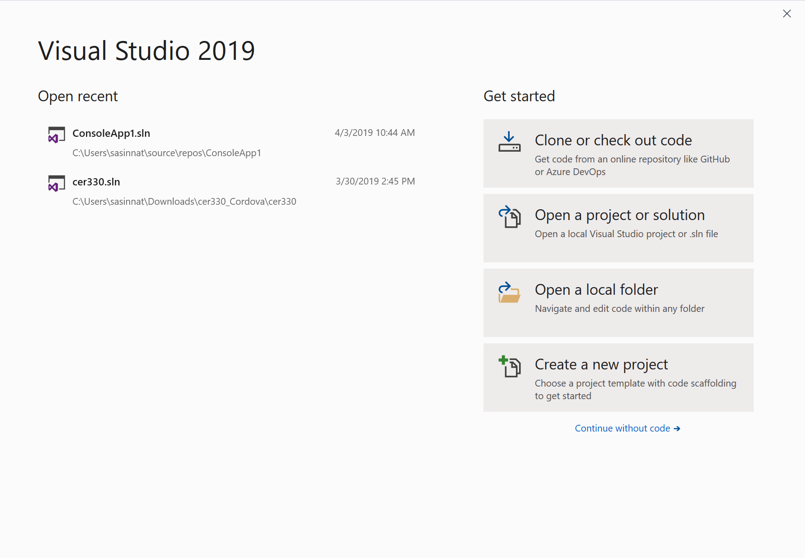

I just uninstalled Visual Studio 2017 and installed Visual Studio 2019 and the transition was very smooth. The installation just took 17 minutes and its faster than the time it took to install earlier versions. I managed to explore few features and it looks quite impressive. I decided to list down the top features that i noticed after exploring them.

## **(i) Live Share :**

The top feature according to me and for almost every developers out there is Live Share. It allows multiple developers from different locations who are working remotely to collaborate and to jointly edit the same code in Visual Studio 2019 in real time.Almost 35 developers can work together on code at the same time and Live Share can be used with both VSCode and VisualStudio and you do not have to install any dependencies or libraries. Is not that cool?

Live sharing is straight forward with a single click of a button, simply requiring you to click on the Live Share button, hit 'Start collaboration session'.

The same can be done on VSCode as well. Amazing thing here is you get to see each and every action of other developer and what he/she is doing. There's also an audio channel so you can talk to those collaborating with you. With this real problem of collaboration is solved.

## **(ii) Smarter IntelliCode for AI:**

One of the coolest thing that every developer like about Visual Studio is **IntelliSense** support. With Visual Studio 2019 IntelliCode's intelligent suggestions, with a wider range of AI-powered assistance for the auto complete and auto-formatting feature for AI developers and for even someone who wants to get started with AI.

## (iii) New search and project templates

The new Visual Studio 2019 header search box, seen at the top of the screen, is designed to find anything in Visual Studio — including menu items, settings,  
tool windows and more. The tool uses fuzzy search that return the correct information even if you make a typo(like google).

Additionally, fresh look of the new project window is really cool. You get to search for the project you want to create in the typehead, rather than having it as a treeview in the earlier versions of visual studio. Also you could add a filter on the window with the provided options as follows.

Microsoft is no more a typical Microsoft as you see above. you get to explore different types of languages with different platforms with Visual studio 2019.

## (iv) Fresh Start window

One other thing which i liked the most in visual studio is the ever fast loading screen of the start window. The team has used asynchronous way to load the previous/recent projects which loads in few seconds which is very faster compared to the previous versions of visual studio.

As you can see, you can now clone or check out a GitHub repository directly from the Start window with devops integration. This is really amazing.

## (v) Developer friendliness

There are n number of cool things have been added to visual studio 2019 to make developers life easy which includes the following features,

**DeCompiled resources :**

Now you can debug and step into the external packages you pull in from Nuget and anywhere! You can enable this by Go to the top menu bar. Select **Tools** > **Options**. Type “decompile” into the search bar. The Advanced section of Text Editor for C# will appear. Click on **Advanced**. Check the box that says **Enable navigation to decompiled sources**

**Code CleanUp:**

In VSCode and VS2017, Similar to _Format Document_, this new feature allows you to configure a predefined set of several rules to clean up in your code all at once. To set this up, follow the steps below.

Click the little **broom** icon at the bottom of the window. Select **Configure Code Cleanup**.

You do not have to manually do things anymore.

**Solution Filter:**

Are you working on the same project for longer years?. Ever had a monolithic solution with way too many projects inside of it? Does it all take a while to load? Now you can save the state of your solution with only the desired projects loaded up. I will not be explaining in detail, certainly this is supported in VS2019. This is a nice way to keep everything organized and loading fast when first opening up the solution in Visual Studio 2019. This can be really refreshing for any enterprise developer who is working on several projects.

### But Wait, There’s More!

Interested in what else this new Visual Studio 2019 has to offer? You can get to know by checking out the [Release Notes](https://docs.microsoft.com/en-us/visualstudio/releases/2019/release-notes-preview) and [FAQ.](https://visualstudio.microsoft.com/vs/preview/faq)

I already started loving the new features, performance and collaboration improvements inside Visual Studio 2019. What about you? Don't wait just get started by downloading from [here](https://visualstudio.microsoft.com/downloads/).
