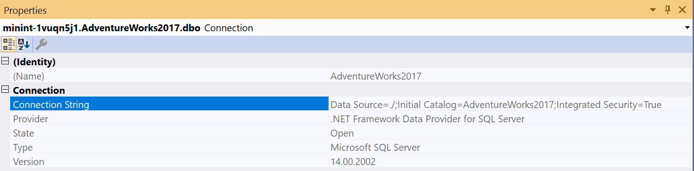

Recently, I was involved in working with a customer who had their data in on prem SQL server. As they are shifting their soultion to Cloud(Azure) with Cosmosdb, the first requirement was to migrate the existing data to Cosmosdb. In this post, I will be explaining on how to do the migration and also how to do the data transformation as Cosmosdb stores the data as key value(JSON) format in the collection whereas MSSQL stores it as a row in the table.

### Cosmosdb Data Migration Tool:

The migration tool provided by Cosmosdb team supports a different various data sources. To date, it can import data that you currently may have stored in SQL Server, existing JSON files, flash files of comma separated values, MongoDB, Azure Table Storage.

##### **PreRequisities**

1. MSSQL Server , if you don't have it grab it from [here](http://www.sqlservertutorial.net/install-sql-server/).
2. Download [Cosmosdb data migration tool](https://docs.microsoft.com/en-us/azure/cosmos-db/import-data#Install).
3. Cosmosdb Account on Azure.

In this post i will show on how to import data from AdventureWorks and if you don't already know, AdventureWorks is a popular sample database for SQL Server. There are more than 40 tables in the database and we will use one of the Views to migrate to the Cosmosdb. Lets pick vStoreWithAddress. It has the columns such as Name,AddressType,AddressLine etc.As we are migrating this data  to Cosmosdb we could make use of nested values by merging address fields together. Let's get started.

###  Step 1:

Connect to **AdventureWorks2017** database and open the view **Sales.vStoreWithAddress.** 

### Step 2:

Lets assume the requirement is to migrate the data which contains the **AddressType** as **shipping**. With this step we will also do the data transformation by merging the address fields together. So the query will be like, https://gist.github.com/sajeetharan/985bd411e3e80ebb8134a16c684748ce  

### Step 3:

Open Cosmosdb data migration tool. You can open it by clicking the **dtui.exe** inside downloaded folder  as mentioned in the prerequisites section.

### Step 4:

We need to fill the source information in the tool. As we know our data source is from SQL server. Pick the source as SQL. 

### Step 5:

You need to fill the connection string for SQL server, which you can obtain easily by going to server explorer and connecting to the SQL server as follows.  Once you enter the connection string verify if its working by clicking on verify.

### Step 6:

Next step is to enter the query to select the source data, we can do this by either pasting the query or by selecting the SQL query file. 

### Step 7:

We need to give the Nesting Operator as “.” As we have used to merge the Address parts as one object. Once this is done click on next.

### Step 8:

Next step is to fill the target information, as you know here our target database is Cosmosdb. I assume you have a Cosmosdb account, you can obtain your connection string by navigating to Azure portal and select Cosmosdb account.

 Once you copy paste the connection string, one more extra thing you need to do is to append the database with the connections string https://gist.github.com/sajeetharan/1e6e21339820b8437b1d9542e8133d51#file-sajeetharan-com\_4192016\_mssql\_cosmosdb You can verify the connection string by clicking on verify button. Also give the collection name as you prefer. It is important to define a **PartitionKey** in order to query the data later.Partition key is used to group multiple documents together within physical partitions. Let's partition by **“/address/postalCode”** which we're storing as postal code nested beneath address and for throughput, we'll just go with the default here of a thousand request units per second. One more thing we need to set the **indexing policy**. You'll notice this large text box here where you can set the indexing policy.I want to choose the range indexing policy which you can do here is by right clicking inside the text box and selecting from the context menu.  Just click Next and you will be taken to the summary page, where you can review the Migration steps at once.

### Step 9:

Once you click import on the last step. You will see a successful message as all the data been transferred with the number of documents created. 

### Step 10:

You could verify the migration by running a query on the Cosmosdb data explorer as follows,  That's how you  migrate data from SQL server to Cosmosdb and it is very easy using the Cosmosdb Migration tool. For the other modes of data migration i will be writing separate blogs. Hope this blog helps if someone wants to transform data and migrate the data from MSSQL to cosmosdb. Cheers!
