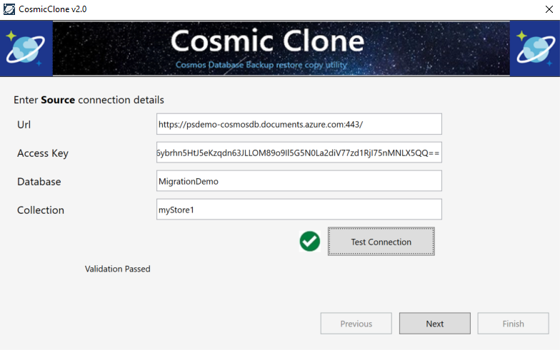
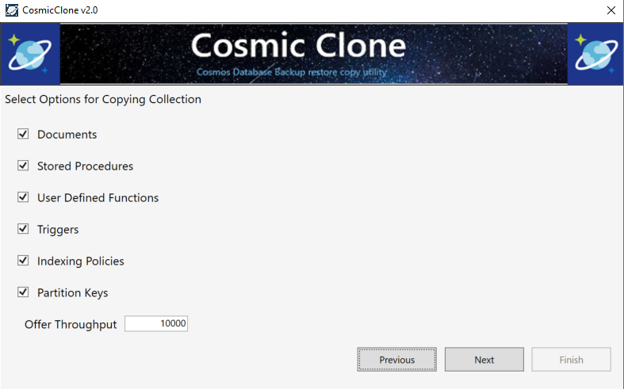
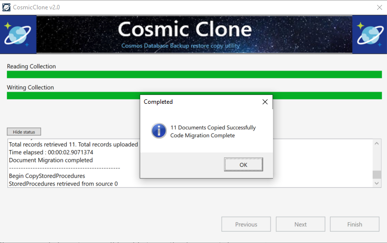

In any business, the value of your data is the cost to reproduce it.  For an instance if the data came from any form the cost is the amount of money in wages to recreate the data in the same form where it came from. While in the case of application running in production, some data can’t be reproduced. So if lost or destroyed, and there is no backup no amount of money can get it back. It is really important that having a data backup and recovery plan is important to the overall success of your business. If there is no data backup plan business can suffer from permanent data loss, massive downtime, and unnecessary expenses.

### What is Cosmic Clone?

If you are from a SQL background dealt with many relational databases, system like SQL server, this can be achieved by out of the box tools such as SQL backup and N number of tools. If you are from NOSQL background and a fan of Azure CosmosDB (Microsoft’s NoSQL Document\\Multi model Database) there has not been really a good tool to perform these tasks up to now. Personally i have been waiting for long time to get this kind of tool out. Finally Cosmic clone has arrived to serve the purpose.

### Features of Cosmic Clone

- To clone collections for any environments
- Create collections with similar settings(indexes, partition, TTL etc)
- To Anonymize data through scrubbing or shuffling of sensitive data in documents.

### How does it differ from Cosmosdb Migrator tool?

As a Cosmosdb user, you might have already familiarized with the Cosmosdb migration tool. Data migration tool actually helps to copy documents but does not provide options either to create a similar collection (with partition keys or indexes) and it does not provide a way to copy the related code starting with stored procedures, UDFs, and triggers etc. Further, there are no options to anonymize data in a collection.  
Cosmic Clone help to ease the above process and aid in the copy and anonymization of a cosmos collection.

### How to use it?

#### Prerequisites:

- Microsoft .Net Framework 4.6.1 or higher
- Source Cosmos collection and read only keys to its account (Could be production environment)
- Destination Cosmos Account and its read write keys
- Make sure the IP address of the machine running the tool is allowed in the firewall settings.

#### Deployment:

1. Navigate to [https://github.com/Microsoft/CosmicClone](https://github.com/Microsoft/CosmicClone) and clone the repo (Switch to the demo branch if the master is not stable)
2. Just Compile and Run the Code.
3. Or Download a pre compiled binary from the releases section and run the “CosmicCloneUI.exe” file.
4. For Best performance you can run the compiled code in an Azure VM that is in the same region as the source and destination Cosmos Collection. (Source : [https://github.com/Microsoft/CosmicClone)](https://github.com/Microsoft/CosmicClone)

### Create backup of a collection

**Step 1: Provide source connection details.**

Obtain the connection string and the keys from the source cosmosdb account and enter it as below. if you are not sure how to obtain them, read my earlier blog [here](https://sajeetharan.wordpress.com/2018/03/18/setting-up-azure-cosmosdb-with-visual-studio-code-in-local-environment/). You should see a notification as Validation passed once you set up the connection details.

**Step 2: Provide destination connection details**

You can follow the above step to obtain the destination connection details and fill the same way as you did it in the above step.

**Step 3: Provide the options you want to backup**

In this step you could select the things you want to copy over to the destination collection. Starting with Documents, Stored Procedures, User defined functions, Triggers, Indexing policies and Partition Keys.  
All the options are checked by default but allow you to configure to optout of any.

The next step is to Anonymous the data of a cosmos collection. But this is necessarily not needed if you are doing just a backup.

**Step 4: See the data in the document explorer**

That's all, once you click next, you will be able to see the documents being transferred to your new collection as per the settings you've provided. Within few clicks you can transfer the data from one collection to another collection residing in another account. Also you can see the status of each copied items in the logs window. Once it is done, explore the destination cosmos portal and one can observe the new collection created with the required settings.

### How anonymization  helps with GDPR?

As we have seen it in the 3rd step, you are provided with an option to anonymize the data with few settings. With GDPR now you should mandate data anonymization in all non-production environments. With the amazing cosmic clone tool it can save the manual effort of a developer, as we will no longer need to write, test, update, or maintain their own anonymization scripts. Is not it cool? You can read about the steps to anomyze the data from [here](https://github.com/Microsoft/CosmicClone#anonymize-data-of-a-cosmos-collection). Based on my experiment with Cosmic tool, it is the best tool so far to backup\\clone\\restore a azure Cosmos database Collection. Try it out and see. If you want to contribute to the repo, you can do that as well. Cheers!
