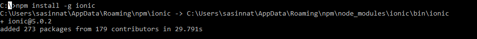

I was at the Global Azure Bootcamp recently concluded last week, one of the participant came and asked me, "Hey what is Cosmos DB" I casually responded “Well, that’s Microsoft’s globally distributed, massively scalable, horizontally partitioned, low latency, fully indexed, multi-model NoSQL database". The immediate question came after that was whether it supports hybrid applications. In this blog I will be explaining how to leverage the features of cosmos db when you're building hybrid applications.

[Ionic framework](https://ionicframework.com/) is an open source library of mobile-optimized components in JavaScript, HTML, and CSS. It provides developers with tools for building robust and optimized hybrid apps which works on Android,IOS and web.  Ionic comes with very native-styled mobile UI elements and layouts that you’d get with a native SDK on iOS or Android.

Let's see how to build Hybrid application with Ionic and Cosmosdb

#### PreRequisites:

You need to have **npm** and **node** installed on your machine to get started with Ionic.

**Step 1:** Make sure you've installed ionic in your machine with the following command,

**ionic -v**

**Step 2: Install Ionic globally**

if it's not installed, install it by using the command

**npm i -g ionic**

**Step 3:** Create a new ionic project

Ionic start is a command to create a new ionic project. You pass in the directory name to create, and the template to use. The template can be a built-in one (tabs, blank) or can point to a GitHub URL.

The aim is to create a simple ToDo application which displays lists of tasks, and user should be able to add new tasks.

Lets create a blank project with the command

 **ionic start cosmosdbApp tabs**

You will see a new project getting created.

**Step 4:** Run the ionic app

You can run the app with a simple command by navigating to the folder and then run

**Ionic serve**

This starts a local web server and opens your browser at the URL, showing the Ionic app in your desktop browser. Remember, ionic is just HTML, CSS and JavaScript!

It will open the application in the default browser with the default app.

If you're stuck at any point you can refer to my slides on How to get started with Ionic and follow the steps.

[https://slides.com/sajeetharansinnathurai/ionicnsbm#/10](https://slides.com/sajeetharansinnathurai/ionicnsbm#/10)

**Step 5:** Create the cosmosdb account on azure portal,

We need to create an cosmosdb account and use the Endpoint and SecretKey in our application. You can follow the

Blog on how to create it from the azure portal

[https://sajeetharan.wordpress.com/2018/03/26/wear-out-the-features-of-azure-cosmosdb-with-aspnetcore-application/](https://sajeetharan.wordpress.com/2018/03/26/wear-out-the-features-of-azure-cosmosdb-with-aspnetcore-application/)

Create a database named "**ToDoList**" and containeras "**Items**".

Once created, lets go back to the application.

**Step 6:** Lets add Cosmosdb SDK to the project

To consume the Cosmosdb service in the application we need to add the [Azure Cosmos Javascript SDK](https://www.npmjs.com/package/@azure/cosmos) to the project. This can be done with the command

**npm i @azure/cosmos**

**Step 7:**  You need to create an interface/model which will be used to save/retrieve the objects from the cosmosdb

https://gist.github.com/sajeetharan/a1dff67c87dce10bc2220aa0e9c550c3

**Step 8:** You need to add two pages home and todo page , home to display the lists of items inside the containerand todo page to add a new item. These two pages can be generated insdie the module with the command,

**ionic g page home**

**Ionic g page todo**

https://gist.github.com/sajeetharan/85229d091990d149b9c09d71f3387287

**Step 9:** We need to add a service to embed the logic to communicate with the cosmosdb you can create a new service inside the module as,

**ionic g service cosmos**

https://gist.github.com/sajeetharan/d7336abce15fa4d10ffd9d806b819462

As we need to make use of the available methods inside the **@azure/cosmos** You can import cosmos with the line,

**import \* as Cosmos from "@azure/cosmos";**

Now make use of all the available functions in the SDK to add,delete,update items in the cosmosdb.

**Step 8:** To make application compatible with android/ios , run the following command,

**Ionic cordova build ios/android**

If you want to make the development faster, you could try building your ionic application with capacitor as well.

Now your hybrid application uses cosmosdb as a backend, with this demo you know how to use cosmosdb as a database for your hybrid application. I hope you should be able to create more applications in the future with cosmosdb and ionic.

You can check the demo application source code from [here](https://github.com/sajeetharan/ionicosmos).
