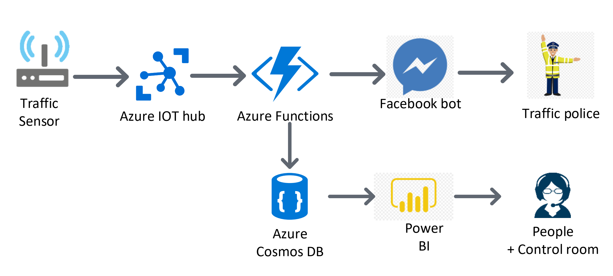

Road traffic is a very classic and burning problem in Sri Lanka and in most of the Asian countries. Personally I have to spend 2 hours on the road everyday by just stuck in the traffic and I assume the same for other people who gets stuck for many hours with no way out.

I was thinking of implementing a solution through various ways with PaaS provided by Azure, this blog focus on one of the solution with Azure by using various services such as IOT hub,Functions,Cosmosdb,Powerbi and bot framework

## Overall Architecture:

#### Components used:

- Azure IOT hub
- Azure Functions
- Azure cosmosdb
- Power BI

## How it works?

IOT sensors can be placed in heavy traffic areas to monitor traffic level along the road. Everyone can access the data using Facebook messenger bot and subscribe on specific road/area. When there is heavy traffic, push notification will be sent to subscribers allow them to avoid that area and redirected to some other road. Also a notification will be send to the traffic police to take over the control.

## How to build?

The high level architecture includes 4 steps.

- IOT sensors placed over the areas will send data to the Azure IOT hub.
- Azure [IoT Hub](https://azure.microsoft.com/en-us/services/iot-hub/) will be configured to trigger Azure Functions to Store data into [Cosmos DB](https://docs.microsoft.com/en-us/azure/cosmos-db/introduction)  and also send notification to Facebook messenger bot(This could be replaced with LINE,Telegram,Skype etc) subscribers.
- [Facebook messenger bot](https://docs.microsoft.com/en-us/azure/bot-service/bot-service-channel-connect-facebook?view=azure-bot-service-4.0) connects to [Azure Functions](https://azure.microsoft.com/en-us/blog/introducing-azure-functions-2-0/) which will acts as serverless bots over HTTPS and  Azure Functions to process message from Facebook messenger users and reply back
- [PowerBI](https://powerbi.microsoft.com/en-us/) connects to Cosmos DB and then Visualize Traffic level on map in real time and could be displayed on the control room.

I will be implementing this POC and publish the code in my github repository in the coming days. In the meantime if you have any suggestions feel free to comment below.
