When you are involving in an architectural discussion which involves Azure's cosmosdb, a mandatory question that you get is "Is not Azure Cosmos DB very expensive?". Based on the fact that Cosmos DB is evolving very fast, there are lot of customers stepping in to use the service in their architecture. To understand one thing Cosmos DB is not priced based on the usage the pricing is based on what you reserve. One of the best serverless example we could consider here is renting out a car rather than managing and hailing it. Key point here is you pay for what you reserve, which is the capacity, which is refered in terms as Request Units (RUs). Any customer consuming the Cosmos DB serivce will be paying for the RUs as well as the space.

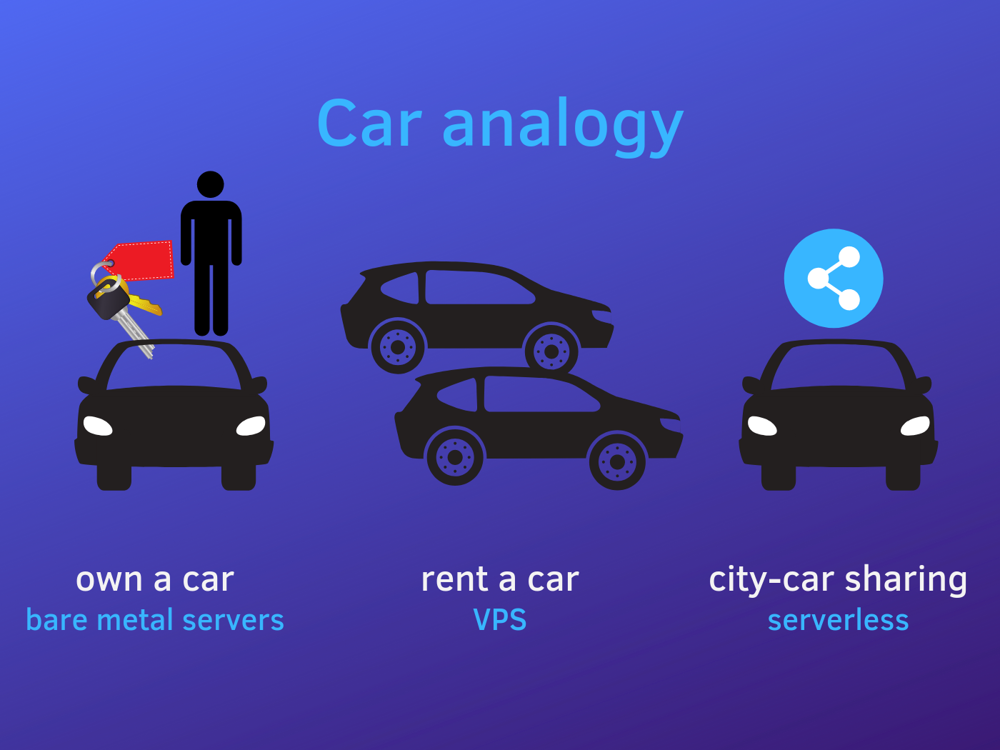

There have been many questions asked on forums,discussions on how to scale up/down cosmos DB Request units. Being a fan of two major services in Azure, i decided to write on how to scale Cosmos DB with Azure function.Azure Functions and Cosmosdb services are getting more closer and closer together in the recent times. One of the case study that we can consider here is whenever you are experiencing throttling(429) due to the burst of high traffic for a period of time, you will be increasing the Request Units(RUs) in the portal to handle it. Which is sort of a pain to handle it manually and the resulting cost will be very high if you've forgotten to scale it down. Let's see how to autoscale using Azure function to mitigate this issue. It involves 2 steps ,

- Create an Azure function to scale throughput on a collection and publish
- Connect the function to CosmosDB alert using an HTTP webhook.

The following solution will help you only to scale up , but the same function can be used to sacle it down if you pass a negative value for the CosmosDB\_RU attribute.

### Step 1: Let's create the Function and Publish

Step 1: Open Visual Studio 2019

Click **File->New Azure Functions** from the templates available and give a name for your function and click ok. I have given the name as **Cosmos\_scale**

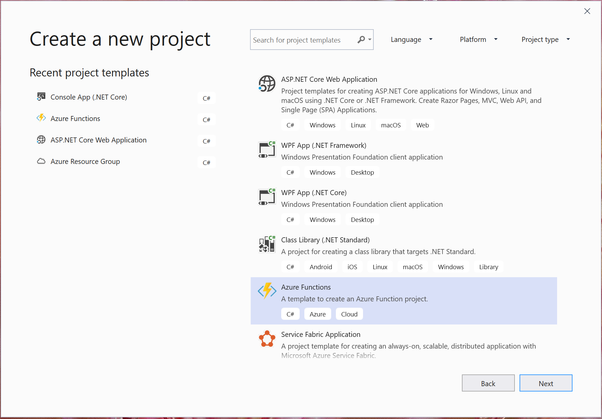

I will be using Azure function 2.x , so you will be taken to a new window where select Trigger type as HttpTrigger and select Authorization level as Function and no need for Storage Account

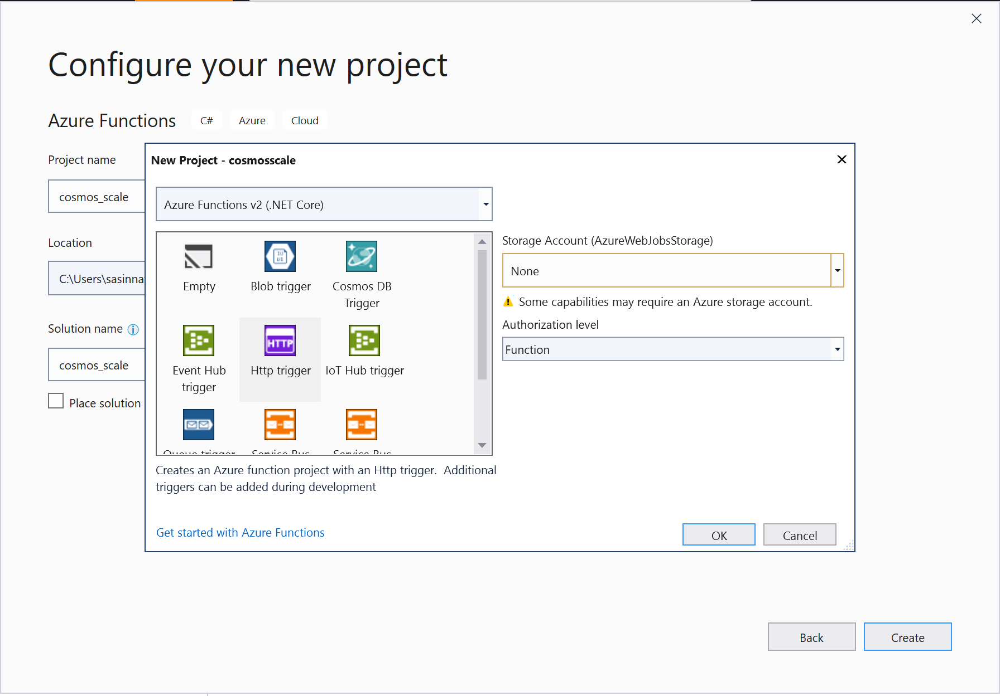

Once the project is created, rename the default Function1.cs with your name, in this case it will be **Cosmosscale.cs**. Let's get into the actual implementation of the function

**Step 2**: **Add Microsoft.Azure.Documents.Core Nuget Package to the solution**

In order to communicate with the Cosmos DB account and make use of the operations let's add the Nuget package Microsoft.Azure.Documents.Core package.

**Step 3:** **Add Microsoft.Extensions.Configuration to the solution**

In order to connect to Cosmos DB we need to get the connection string and the key from the appsettings, lets add Microsoft.Extensions.Configuration. For Azure Functions v2, the ConfigurationManager is not supported and you must use the ASP.NET Core Configuration system:

Let's understand the logic here,

As a first step, lets create the Client to connect to Cosmos DB

https://gist.github.com/sajeetharan/788a6acf99416dde8e6ebd652c2b3ed2

Get the connection self link

https://gist.github.com/sajeetharan/80c87e46cf2969eb11c3c4971f6759ac

As we have already created the account and the collection, lets get the current offer of it

https://gist.github.com/sajeetharan/a3d2d5357791f50276585aa2a04461c1

Let's get the current throughput count

https://gist.github.com/sajeetharan/38302ad7f17b4844afdfd6fd0162e776

Set the new offer with the throughput increment added to the current throughput

https://gist.github.com/sajeetharan/d38fbb251e9e57177a5e68c5735a0fef

That's it, additional step would be to handle the failure and return the response back.

This is how the whole function would look like,

https://gist.github.com/sajeetharan/06544e38bb460df5de44cbaef9b05b43

**Step 4: Add the config values to local.settings.json**

Now we need to add the values to "local.settings.json". These values will be used to test the function locally before deploying it to Azure.

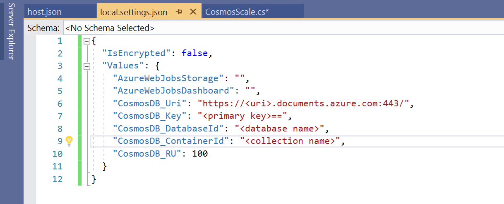

The setting key "CosmosDB\_RU" is to increase the RU by 100, and if you want to decrease you can set a negative value say "-100".

You can get these values from the portal by navigating to the Cosmos DB account.

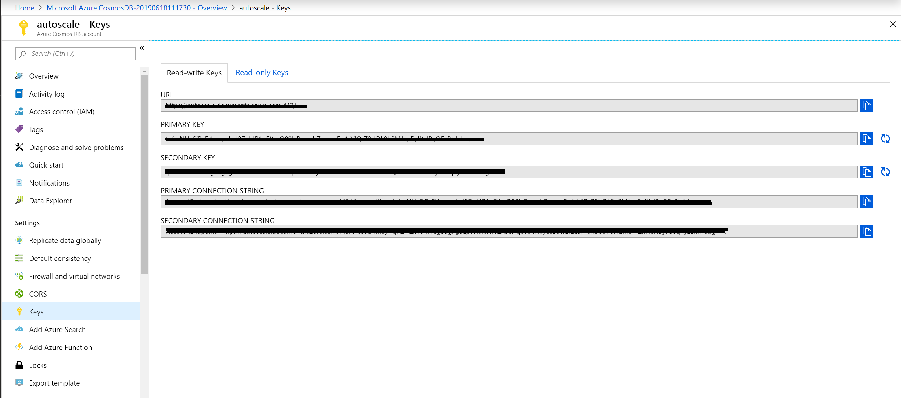

**Step 5: Check the function with Postman**

Now we have setup and created the function locally. To test the app locally, click on the run button. Using PostMan send a GET or Post request by using the url

http://localhost:7071/api/Cosmosscale

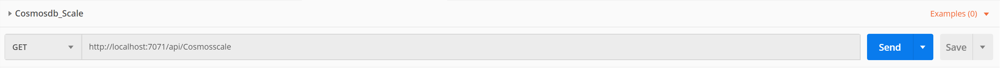

If you have followed the steps and set up everything correctly, you will be seeing he following response in the console. LogInformation messages will specify the current and the provisioned throughput.

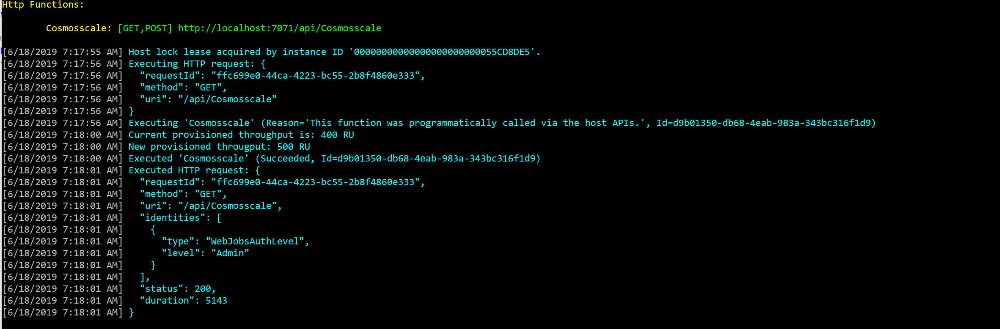

Now we have successfuly tested the autoscaling function in local. Let's publish the Function.

#### Publish the Function on the portal

In this ste, lets deploy the function through the portal to the new function app.

Navigate to the Azure portal and provision a Function App with the default settings.

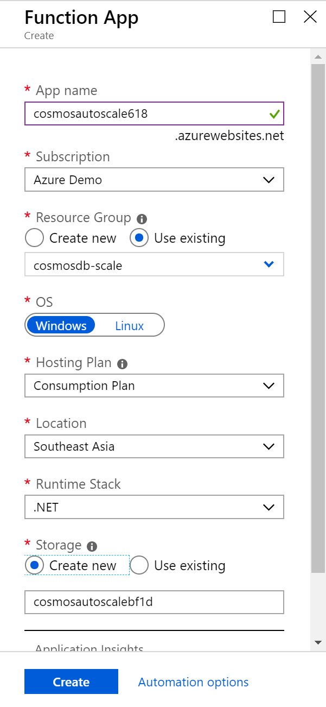

Click on **“Function app settings”** on your Function App’s homepage, then click on **“Manage application settings”**. Add the values in the table below to Application settings. The advantage of Adding values to Application settings allows the function’s manager to edit the values later.

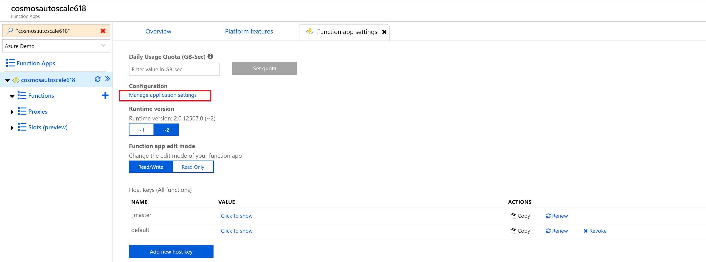

<table><tbody><tr><td><strong>Key</strong></td><td><strong>Value</strong></td></tr><tr><td>CosmosDB_Uri</td><td><a href="https://.documents.azure.com:443/">https://&lt;uri&gt;.documents.azure.com:443</a><a href="https://.documents.azure.com:443/">/</a></td></tr><tr><td>CosmosDB_appKey</td><td>&lt;primarykey&gt;</td></tr><tr><td>CosmosDB_DatabaseId</td><td>&lt;database_name&gt;</td></tr><tr><td>CosmosDB_ContainerId</td><td>&lt;container name&gt;</td></tr><tr><td>CosmosDB_RU</td><td>&lt;RU increment/decrement as integer&gt;</td></tr></tbody></table>

Let's publish the function app using Visual Studio.

Right click on the project file > **Publish… > Select Existing > Publish >** Select the Function App we provisioned in the previous step and click ok.

<figure>

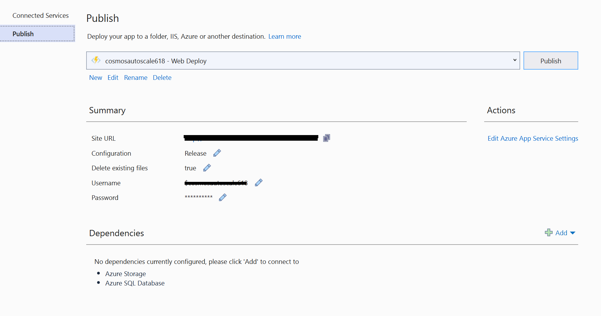

<figcaption>

  
  

</figcaption>

</figure>

Now we have successfuly deployed the function to Azure. Let's do the final step

Test the function on Azure by navigating to the function, in the portal blade, and clicking run. We should see the following output if the function succeeds.

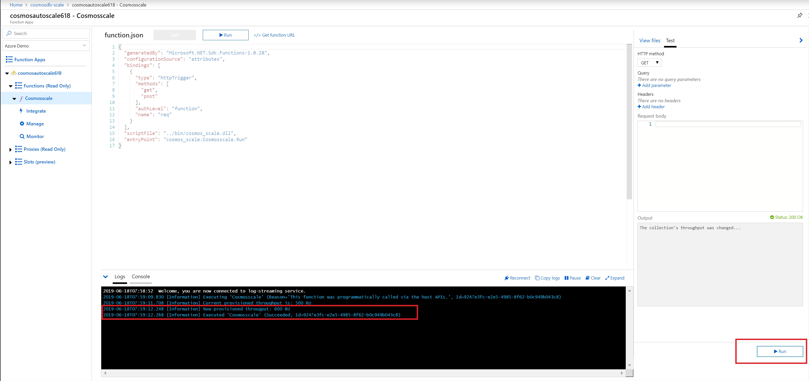

If it does not work, make sure you have entered the configuration correctly in the app settings.

You can access the full source code from [here](https://github.com/sajeetharan/cosmosdb-autoscale-function-V2.0).

As this function can be invoked periodically, you can ammend the logic to scale up/down RUs based on time/month/year etc.

Now you can use this function url as a webhook and can be called from anywhere to scale up/down automatically. Hope this will help someone out there to manage the consumption and reduce the cost.
