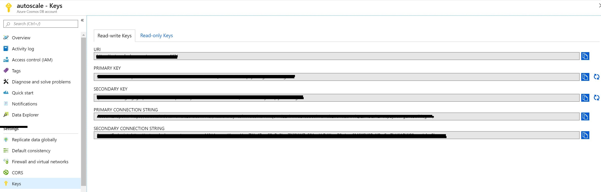
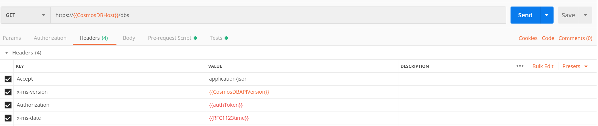
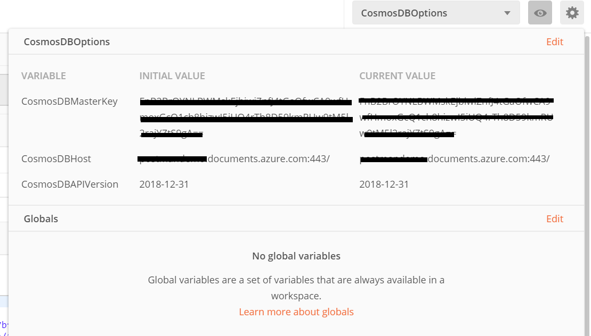
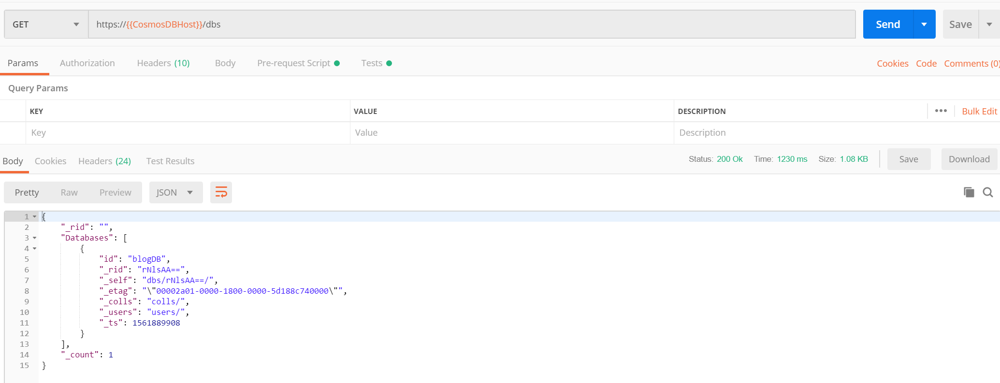

I have been working with Cosmos DB for almost 2 years and most of the time i have used SDKs to connect to Cosmos DB. In the recent times i started consuming Rest API for my hybrid application. One of the tricky part in Cosmos DB is that connecting to it and running queries with REST API. In this blog post, I want to elaborate more on the repository i have created to test the APIs in one go. Also will discuss more on how to call Azure Cosmos DB by using its REST API. I will be using the [Cosmosdb account](https://docs.microsoft.com/en-us/azure/cosmos-db/sql/create-cosmosdb-resources-portal) and [Postman](https://www.postman.com/) tool.

If you are very new to Cosmosdb, read my blog on how to [setup Cosmos DB in local and connect via Visual Studio Code.](https://sajeetharan.wordpress.com/2018/03/18/setting-up-azure-cosmosdb-with-visual-studio-code-in-local-environment/) Many of us come from the SQL background, when we want to connect to SQL Server, usually we need to have a username and password. You need to do more than that to connect and run queries in CosmosDB. But CosmosDB needs some more parameters to connect to it.

Once you create the Cosmos DB account on Azure and navigate to the keys section on the left pane. You will see two types of tabs on the Keys. There are two types of keys, one type of users having the Key can Read and Write. Other type ofusers having the key can only Read. 

Let's understand different terms used while making a connection to Cosmos DB

**Master Keys** are keys are created when the Cosmos DB Account is created. This key can be regenerated by clicking on refresh icon to regenerate them in the Azure portal. When you are using Cosmos DB emulator you won't be able to generate it. These keys are very sensitive ones and provide access to the administrative resources. We should be very careful when weneed to store them. Recommended way is to use Read-Only Keys as much as we can.

  
**Resource Tokens** are responsible for providing access to specific containers, documents, attachments, stored procedures, triggers, and UDFs. Each user must have a resource token. It is mandatory that every application needs to use a resource token to call Cosmos DB API.

  
**Users** are specific for Cosmos DB databases. You can attach specific permissions or roles to each user like the way we do in SQL server.

#### Cosmos DB API

As i mentioned earlier we have many options to access to CosmosDB. Rest API is one of these options and it is the low level access way to Cosmos DB. Most of the features supported with SDK are available and you can customize all options of CosmosDB by using REST API. To customize the calls, and pass the required authorization information, you need to use http headers.

In the following example, I am going to try to create a database in CosmosDB emulator by using the REST API. First let’s look at the required header fields for this request. These requirement applies to all other REST API calls too.

**x-ms-version** : As the name indicates this is the version of the REST API. You can find the available versions [here](https://docs.microsoft.com/en-us/rest/api/cosmos-db/index). If you are confused on what to use always use the latest one.

**x-ms-date :** This is the date of your request. It must be formatted by Coordinated Universal Time. (ex: Sun, 30 June 2019 05:00:23 GMT)

**x-ms-session-token:** It is required if you want to use [session consistency](https://docs.microsoft.com/en-us/azure/cosmos-db/consistency-levels). For each of your new write request in Session consistency, CosmosDB assings a new SessionToken to the calls. You need to track the right session token and use it in this header property to keep usng the same session. SDK does this for you in the background, if you want to use the REST API, you need to do this manually.

**Authorization**: This one is the most important and tricky one. This needs to get generated for each of your call to Cosmos DB. It must be in the following format

**How to Call APIs with Postman:**

To call Cosmos DB directly from [POSTMAN](https://www.getpostman.com/), you need to get the Cosmosdb account URL we need to use. If you are using the emulator, you can get it from the the local environment which should be like [https://localhost:8081](https://localhost:8081/). I will be using the account created in Azure protal.

One other thing you need to setup is the environment variable as you see we are using some of the configured variables in the script, you can create a new environment variable using Postman by navigating to environments and add new environment with configured variables.

<figure>

<figcaption>

Create environments

</figcaption>

</figure>

<figure>

<figcaption>

Configured variables

</figcaption>

</figure>

we need to look at the documentation of [CosmosDB Rest API](https://docs.microsoft.com/en-us/rest/api/cosmos-db/create-a-database). You can find all URL locations from this link. Since I am trying to list the databases inside a collection, I am going to use the following path.

**https://postmandemo.documents.azure.com:443/**

     Also, documentation tells us that this must be a GET Http Action. In Postman, I pick the GET and type the URL to the URL section in the following example.

As Next step, we need to create an environment in Postman to store some variables. As connecting to cosmos db needs a token we need to generate a token for CosmosDB and get the current date to fill the header named **x-ms-date**. I am going to use variables in Environment to store the values. To Create an environment. Click on gears icon and click on Add.

The below example shows the environment variables that we will frequently use to test Cosmos DB API.

As we are requesting to get the list of databases, we are ready to add values to headers section. Click on Headers link, and add the following headers. These are the required HTTP headers for all CosmosDB REST API calls.

**x-ms-version** : 2019-06-30  
(This is the latest version. You can find the other versions [here](https://docs.microsoft.com/en-us/rest/api/cosmos-db/index).)

**`x-ms-date`**: `{{utcDate}}`  
(This is the variable we defined in the Postman environment. Its value will be generated dynamically in the Pre-request Script.)

**`authorization`** : `{{authToken}}` 
(This is the other parameter we just created. We are going to generate its value in script.)

**Accept** : **application/json**.  
(This is required since this is going to be a GET Http Action.)

Your screen should looks like this.

Next, we need to generate an authorization token and the current date in the required format.  
To do this, we’ll use the **Pre-request Script** section in Postman. This script runs automatically before each request. In this step, we’ll generate the `authToken` and `utcDate` parameters.  
Simply copy and paste the following code into the **Pre-request Script** tab:

https://gist.github.com/sajeetharan/c2c1fbc48bf24e3b321323b34232f5a8

We are done with all the things needed to get the list of databases. Click on the send button to see the list of databases as response.

Great! Look at all that information we received back in the body of the Response.

This is the way to test Cosmos DB API with POSTMAN. You can try different APIs with the simple collection we've created [here](https://github.com/sajeetharan/cosmosdb-api-test). Now it becomes easy for developers to leverage the Cosmos DB api and to play around with it.
