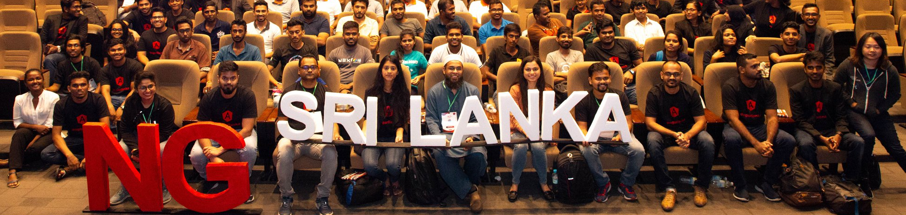

Hey NG folks, [ng-Srilanka 2019](https://www.facebook.com/ngslcon), the First-ever Angular conference on the 14th of September 2019 was a great success. It was a dream come true moment for me. Yes, I am one of those developers who marries one platform or framework and doesn’t care too much about the other ones. I have been an Angularjs/Angular developer for the past 7 years. One of the reasons why I wanted to make this happen was because of the strong and wide Angular community in Sri Lanka. When I became a GDE in Angular in 2018, my first aim was to build a strong developer,especially Angular community in SriLanka. NG-Srilanka has been a 2 year dream and finally I am glad it happened with all grandeur .

To those who missed the event this year, below are some of the biggest highlights and benefits that ng-Srilanka had to offer that you can take right back to your development desk.

#### First ever Angular conference:

It was such an honor for me and my team to organize this fantastic conference for the first time in SriLanka and 2nd Angular conference in SouthEast Asia. When we started it we never imagined NG-Srilanka will grow into a large international conference which will attract such a strong support from the industry.

#### For the community, by the community:

A set of volunteers from the two top universities in SriLanka focused on reaching out to and building interest in the local community. The event was adorned by 400+ passionate developers from 15+ universities and 20+ companies. We ensured that we had a diverse speaker line up and further promoted diversity with scholarships and ensured that most participants made it to the event.

#### NG-Scholarship for students :

Unlike most of the Angular conferences, we came up with a scholarship program to provide free training on Angular by the local experts. The scholarship winners were selected based on the knowledge on Angular and their passion to learn more.

#### Great Agenda:

NG-Sri Lanka 2019 kicked off with [@mgechev](https://twitter.com/mgechev) of the Angular team, who joined us from California and delivered the **keynote**. Later, the sessions were divided into two tracks named "Stacked" and "Sandwich". "Stacked" track touched upon various topics on Angular and "Sandwich track" deep dived into specific workshops. The event was also garnsihed with few lighter moments like entertainment performances by NSBM students.

Finally the speakers addressed the audience in an open QnA session, through which certain Angular topics were further discussed.This was a huge value add for the attendees, and proved truly a platform where many meaningful conversations can happen.

#### An AWESOME Team:

The real success of ng-Srilanka was the team behind it. Thank you, to the fantastic co-organizers who worked with me day and night, the amazing support staff , dedicated volunteers, the sponsors, the awesome speakers and of course the great attendees.I would like to thank everyone who contributed to the success of the event, devoted their time and support to make this conference a big HIT.

Such a nerve wracking but amazing experience! So lucky to work with such a supportive team.

We've been recieving wonderful feedback from the speakers,attendees and several others on social media about the conference. Looking forward to NG-Srilanka 2020!
