### **Overview:**

This year I've started focusing deeply on the areas around App Modernization with various cloud native offerings with different cloud vendors. One of my main focuses has been Kuberentes and how it can help organizations to design scalable applications to cater their needs. Scaling is one of the interesting concepts on Kuberentes and a very important subject to look at. This post will help you to understand the basics of the scalability aspects in Kuberentes and how you can use Event driven Applications with Kubernetes in detail.

**Scaling Kubernetes**

In general, Kuberentes provides two ways to scale your applications with the capabilities such as,

**Cluster Scaling** - It Enables users to add and remove nodes to provide more resources to run on. This is applicable to scale in an infrastructure level

**Application Scaling** - It can be achieved based on how your applications are running by changing the characteristics of underlying pods. Either by adding more copies or by changing the resources available to run same as how you do with services like App service on Azure.

**Cluster Autoscaler :** The first way of scaling can be achieved with [Cluster Autoscaler](https://github.com/kubernetes/autoscaler/tree/master/cluster-autoscaler). It is a tool enables automatically scaling the cluster. Most of the cloud vendors have this capability which automatically add nodes that user don't have to take care of adding more nodes. It basically add nodes when the capacity demand is there and remove nodes when they are no longer needed. I have widely used the Autoscaler with Microsoft [Azure Kubernetes Service](https://github.com/kubernetes/autoscaler/blob/master/cluster-autoscaler/cloudprovider/azure/README.md) which allows you to start scaling your AKS cluster.

### **Event Driven Autoscaling with Kubernetes :**

**Necessity:**

Event-driven applications are a key pattern for cloud-native applications. Event-driven is at the core of many growing trends, including Serverless compute like Azure Functions. There are so many scenarios where Kubernetes with Azure functions can be used in order to serve your applications with minimized cost.

- Hybrid Solutions, Which needs some data to be processed on their environment
- Applications with some specific requirements of Memory and GPUs
- Applications which are already running on Kubernetes, so that you can leverage existing investments

**Example Scenario:**

<figure>

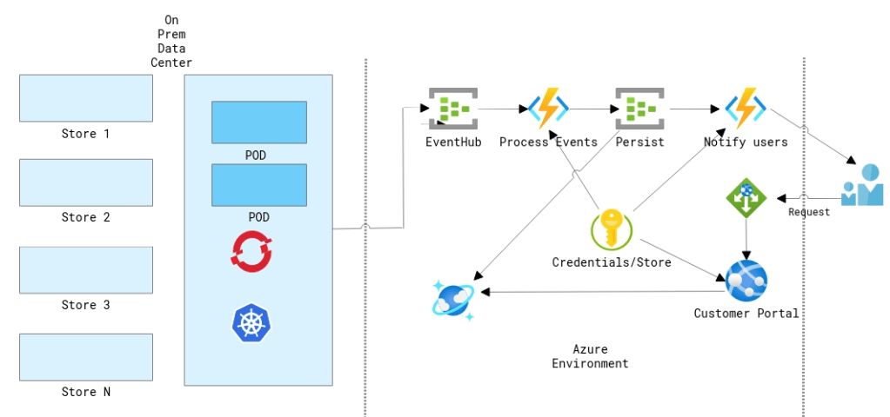

<figcaption>

Customer Scenario

</figcaption>

</figure>

In this example, lets consider a retail customer like eBay. For a retail customers who processing millions of orders and having a hybrid environment. If the customer does a lot of processing on the data center using things like Kubernetes and at some point they push those data to the cloud using eventhub or transform their data and put in the right place etc. What if the customer is getting sudden spike on a certain day like "Black Friday" and need to make sure that the compute can scale rapidly and also wanted to make sure that the orders are processed in the correct manner.

### **Arrival of KEDA :**

Since Azure functions is open sourced  so one of the things that azure functions team working with and talking to the community some partners like Redhat is how can they  start to bring more of these experiences to that other side to where you don't want to have lock-in to a specific cloud vendor and to run these service workloads anywhere could be on other clouds. Kubernetes Event-Driven Autoscaling (KEDA) which is a Microsoft & Red Hat partnership that would make auto scaling Kubernetes workloads a lot easier. With Azure Functions, you write code which is triggered when a certain trigger occurs and they handle the scaling for you, but you have no control over it. With combining Kubernetes you have to tell it how to scale your application so it's fully up to you! On May 6th, 2019 Microsoft announced that they have partnered with Red Hat to build [Kubernetes-based event-driven autoscaling (KEDA)](https://cloudblogs.microsoft.com/opensource/2019/05/06/announcing-keda-kubernetes-event-driven-autoscaling-containers/) which brings both worlds closer together.

### **What is Kubernetes-based event driven autoscaling (KEDA) ?**

KEDA provides an autoscaling infrastructure that allows you to very easily autoscale your applications based on your criteria. Nothing to process? No problem, KEDA will scale your app back to 0 instances unless there is work to do.

**How does it work?**

KEDA comes with a set of core components to provide the scaling infrastructure:

- A **Controller** to coordinate all the work and watch for new `ScaledObjects`
- A **Kubernetes Custom Metric Server**
- A set of **scalers** which allow you to scale on external services

<figure>

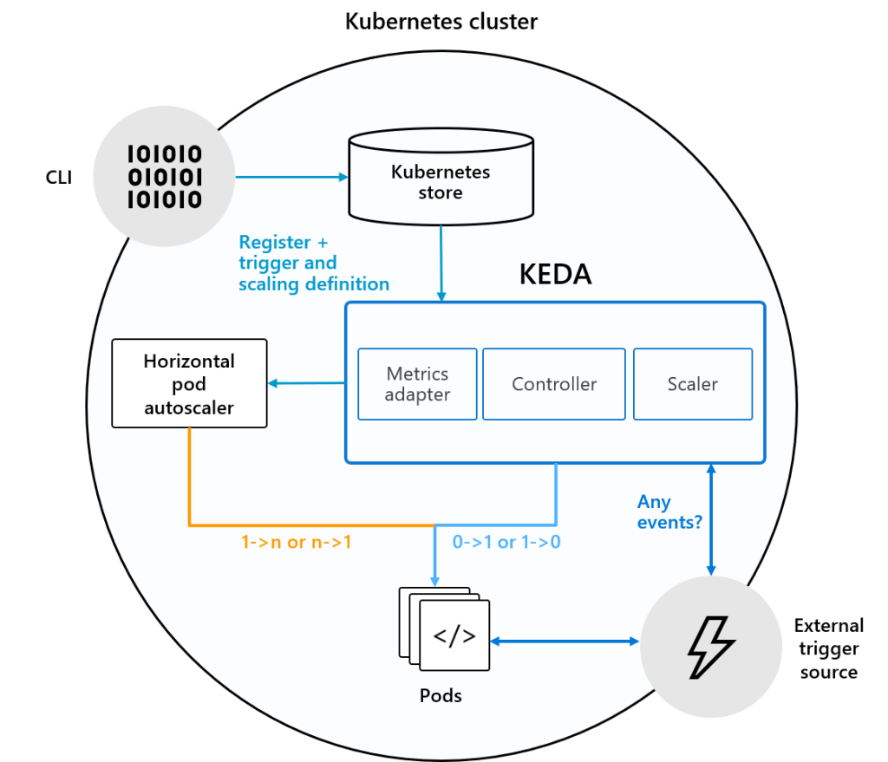

<figcaption>

Kubernetes-based event-driven autoscaling (KEDA) Architecture

</figcaption>

</figure>

The **controller** is the heart of KEDA and is handling the following responsibilities :

1. Watching for new ScaledObjects
2. Ensuring that deployments where no events occur, scale back to 0 nodes. Once events occur, it makes sure that it scales from 0 to n.

**How it Differs from Kubernetes ?**

"**_Default Kubernetes Scaling is not well suited for Event Driven Applications_**"

By default kuberentes is not very well suited for event-driven scaling and that's because by default kuberentes can really only do resource based scaling looking at CPU and Memory.

<figure>
| **What K8s can do?**                | **What K8s can't do?**                   |
|-------------------------------------|------------------------------------------|
| Scheduling of containers            | Invoke code based on external events     |
| Capacity management                 | Scale based on external metrics          |


<figcaption>

When do we need KEDA!

</figcaption>


</figure>

### **Sample Deployment :**

As an application admin, you can deploy **`ScaledObject`** resources in your cluster which define the scaling rules for your application based on a given trigger.

These triggers are also referred to as “Scalers”. They provide a catalog of supported sources on which you can autoscale and provide the required custom metric feeds to scale on. This allows KEDA to very easily support new scale sources by adding an individual scaler for that service. Let’s have a look at a **`ScaledObject`** that automatically scales based on Service Bus Queue depth.

<figure>

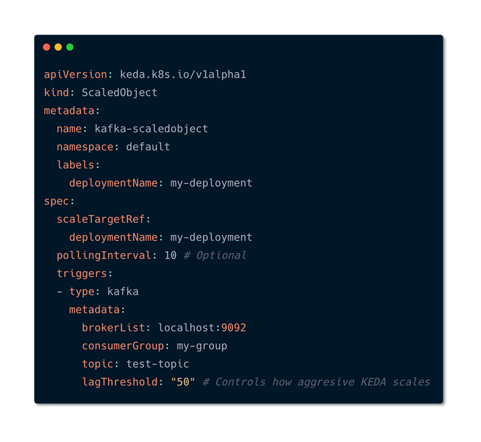

<figcaption>

Scaled Object Deployment with Kafka using KEDA

</figcaption>

</figure>

As you see in the file, All it contains is that whatever deployment that you are going to scale it goes under **scaletargetreference**. You can also set some metadata such as how frequently to pull for events that you can control. Metadata such as Minimums and maximums and then you can define the event source in this case it is mention as Kafka, you can also mention things like service bus etc. Once the deployment is applied on kuberentes you can see that it will identify that scaled objects. Based on the events on the eventssources it is going to identify and scale it automatically. HPA does the autoscaling.

### **Run Azure Functions Anywhere**

With the production release of KEDA back in 2019, you can now safely run your azure function apps on Kubernetes and its recommended by the product group. This allows the users to build serverless applications once re-use them on other infrastructures as well. Let's see How to build an application that supports the above scenario discussed.

### **PreRequisities :**

This article requires you to have the following tools & services:

- Azure CLI
- Azure Subscription
- .NET Core 3.1
- Kubernetes cluster with [KEDA installed](https://github.com/kedacore/keda#setup)
- Function Tools
- Visual Studio Code
- Docker Desktop

**Step 1: Create a Resource Group**

First step is to create the resource group using which all the necessary resources will be grouped together!

[https://gist.github.com/sajeetharan/839847fe89b1b3ea90679ae7d2782d6e.js](https://gist.github.com/sajeetharan/839847fe89b1b3ea90679ae7d2782d6e.js)[View this gist on GitHub](https://gist.github.com/sajeetharan/839847fe89b1b3ea90679ae7d2782d6e)Create Resource Group Named "rgKeda" in "Southeastasia" region

**Step 2 : Create a Storage Account**

Let's create a Storage Account to store the order messages, You can do this by the command,

[https://gist.github.com/sajeetharan/fc885f9ddb7916c015ff470823f1c8f0.js](https://gist.github.com/sajeetharan/fc885f9ddb7916c015ff470823f1c8f0.js)[View this gist on GitHub](https://gist.github.com/sajeetharan/fc885f9ddb7916c015ff470823f1c8f0)Create Storage Account Named "sakeda"

**Step 3 : Create a Queue in Service Bus**

Next step is to create the queue to store the orders under the namespace "sbqOrders"

[https://gist.github.com/sajeetharan/685feca2dbc8e591a759a8da4b36c491.js](https://gist.github.com/sajeetharan/685feca2dbc8e591a759a8da4b36c491.js)[View this gist on GitHub](https://gist.github.com/sajeetharan/685feca2dbc8e591a759a8da4b36c491)Create Storage Queue to store the order messages

**Step 4 : Create Azure Kubernetes Service**

To showcase the feature of event driven scaling with the kubernetes let's create a Kubernetes cluster on Azure with two nodes.

[https://gist.github.com/sajeetharan/94812cad484f0de46490e5069e08a8c6.js](https://gist.github.com/sajeetharan/94812cad484f0de46490e5069e08a8c6.js)[View this gist on GitHub](https://gist.github.com/sajeetharan/94812cad484f0de46490e5069e08a8c6)

Once these resources are created you can double check it by navigating to azure portal and opening the resource group.

<figure>

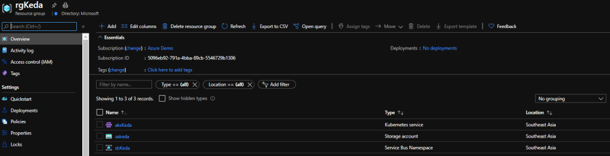

<figcaption>

Resources for the Kubernetes Event Driven Autoscaling

</figcaption>

</figure>

Now we have created all the necessary resources. In the above step you can see that we have create two nodes but have not deployed anything to those nodes, but in real scenarios that nodes can contain some applications already running on Kubernetes.

**Step 5 : Create Azure Function to Process the Queue Message**

Let's create an Azure function to process these queue messages, you can navigate to the folder and create a containerized function as follows,

[https://gist.github.com/sajeetharan/569c6ef142d5b64ce5a5c3fb134e920d.js](https://gist.github.com/sajeetharan/569c6ef142d5b64ce5a5c3fb134e920d.js)[View this gist on GitHub](https://gist.github.com/sajeetharan/569c6ef142d5b64ce5a5c3fb134e920d)Create a containerized Function

Make sure to select the preferred language and the app will be created as follows,

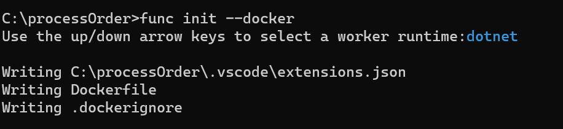

lets create the new function as ,

[https://gist.github.com/sajeetharan/d24f16c79111688f5c2167bf8947856f.js](https://gist.github.com/sajeetharan/d24f16c79111688f5c2167bf8947856f.js)[View this gist on GitHub](https://gist.github.com/sajeetharan/d24f16c79111688f5c2167bf8947856f)Create new function

In this case we need to create a function to get triggered when there is a new message in the queue, so select the Trigger as QueueTrigger from the template,

<figure>

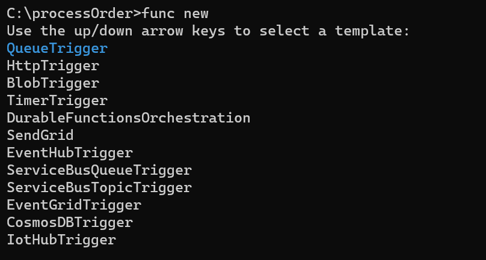

<figcaption>

Select Queue Trigger

</figcaption>

</figure>

and give a function name as follows,

<figure>

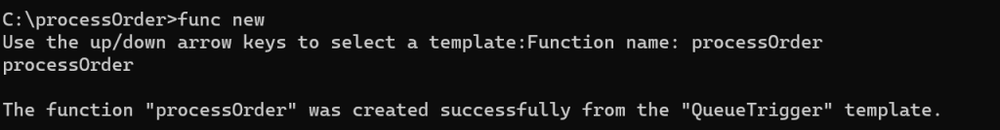

<figcaption>

Create Function with QueueTrigger template

</figcaption>

</figure>

Open the function in vscode and configure the storage queue connection string in the **local.appsettings.json**, the connection string can be obtained from the Azure portal in **Storage Account "saKeda" -> Queues -> Access Keys**

```
{
    "IsEncrypted": false,
    "Values": {
        "AzureWebJobsStorage": "UseDevelopmentStorage=true",
        "FUNCTIONS_WORKER_RUNTIME": "dotnet",
        "StorageConnection": "DefaultEndpointsProtocol=https;AccountName=sakeda;AccountKey=uPmdavPQ5DOYD3A5sJbeODP5He9OBv3sYpmlGj6fs7mQYZsk7P/ShP6Go9u+waBBean+1PJwjUEkGVnRsHf/rNg==;EndpointSuffix=core.windows.net"
    }
}
```

Whole function code can be viewed from [here](https://github.com/sajeetharan/azFnKedaProcessOrder).

**Step 6 : Build the function and Enable Keda on AKS cluster**

As we have everything ready, let's build the function with the below command,

```
 docker build -t processorder:v1 .
```

As the next step , we need to enable KEDA on the Azure Kubernetes Cluster. This is similar on any Kubernetes environment which can be achieved by below,

[https://gist.github.com/sajeetharan/76b6529d6adc0235f50921d0ba6c0519.js](https://gist.github.com/sajeetharan/76b6529d6adc0235f50921d0ba6c0519.js)[View this gist on GitHub](https://gist.github.com/sajeetharan/76b6529d6adc0235f50921d0ba6c0519)

**Keda.yaml** is the configuration file which has all details. In our case we define that we want to use the `queue` trigger and what our criteria is. For our scenario we’d like to scale out if there are 5 or more messages in the `orders` queue with a maximum of 10 concurrent replicas which is defined via `maxReplicaCount`. Let's apply the yaml file on the cluster.

```
kubectl apply -f keda.yaml --namespace="kube-system"
```

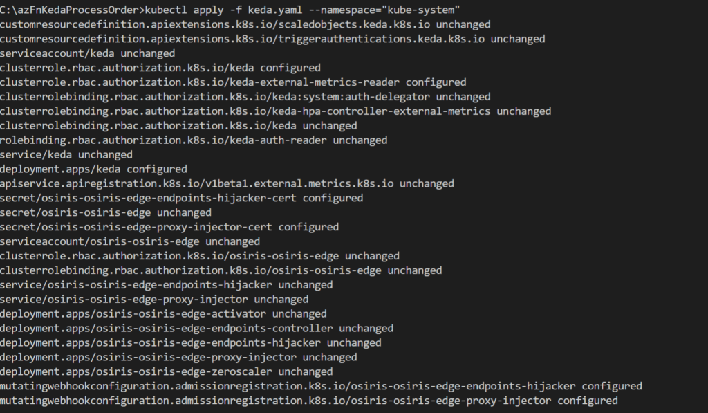

**Step 7 : Deploy the container as Azure function extended with AKS**

Final step is to deploy the function to kubernetes environment with the following command,

[https://gist.github.com/sajeetharan/fc52f2e6a686bca16acc190fee2137c0.js](https://gist.github.com/sajeetharan/fc52f2e6a686bca16acc190fee2137c0.js)[View this gist on GitHub](https://gist.github.com/sajeetharan/fc52f2e6a686bca16acc190fee2137c0)

Make sure that you are tagging the correct registry name , here i am using my docker registry, instead you can consider using Azure Container Registry as well.

Let's view the kubernetes cluster. if you have install the kubernetes extension you can easily view the status of the cluster using vscode.

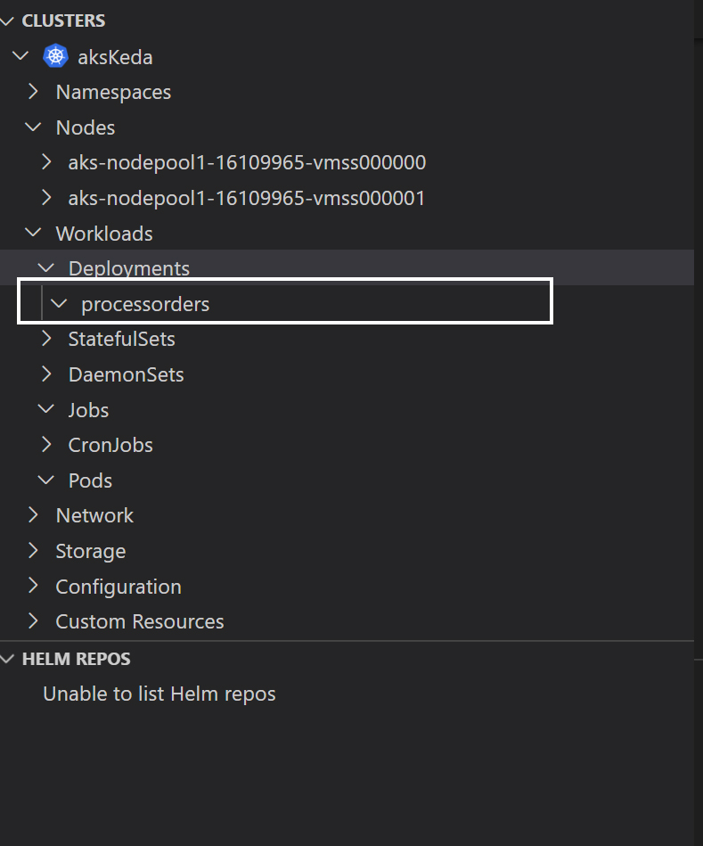

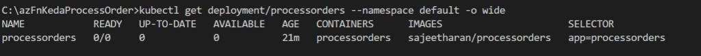

**Step 8 : Publish messages to the Queue**

Inorder to test the scaling of Azure function with KEDA, i created a sample console application which pushes the messages to the queue we created. And the code looks as follows,

```
using Microsoft.WindowsAzure.Storage;
using Microsoft.WindowsAzure.Storage.Queue;
using System;
using System.Threading;
using System.Threading.Tasks;

namespace Serverless
{
    class Program
    {
       static async Task Main(string[] args)
        {
            CloudStorageAccount storageClient = CloudStorageAccount.Parse("connection string");
            CloudQueueClient queueClient = storageClient.CreateCloudQueueClient();

            CloudQueue queue = queueClient.GetQueueReference("sqkeda");
            for (int i = 0; i < 100000000; i++)
            {
                await queue.AddMessageAsync(new CloudQueueMessage("Hello KEDA , See the magic!"));
            }

        }
    }
}
```

As the messages are getting inserted to the queue, the number of replicas gets increased which you can see from the image below.

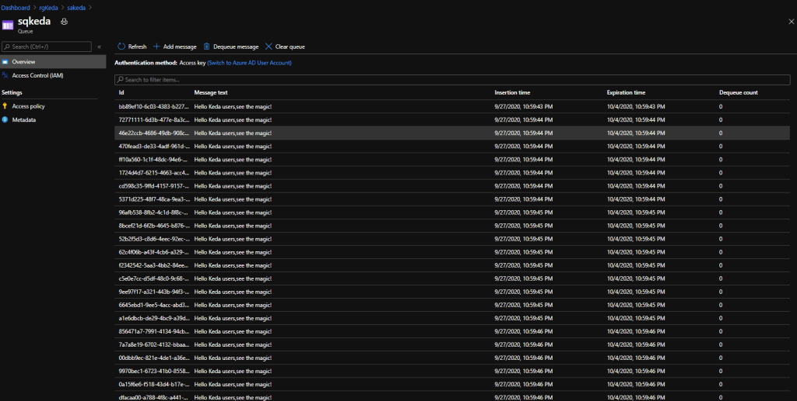

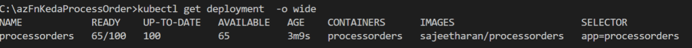

Once all the messages have been processed KEDA will scale the deployment back to 0 pod instances. Overall process is simplified in the diagram below,

<figure>

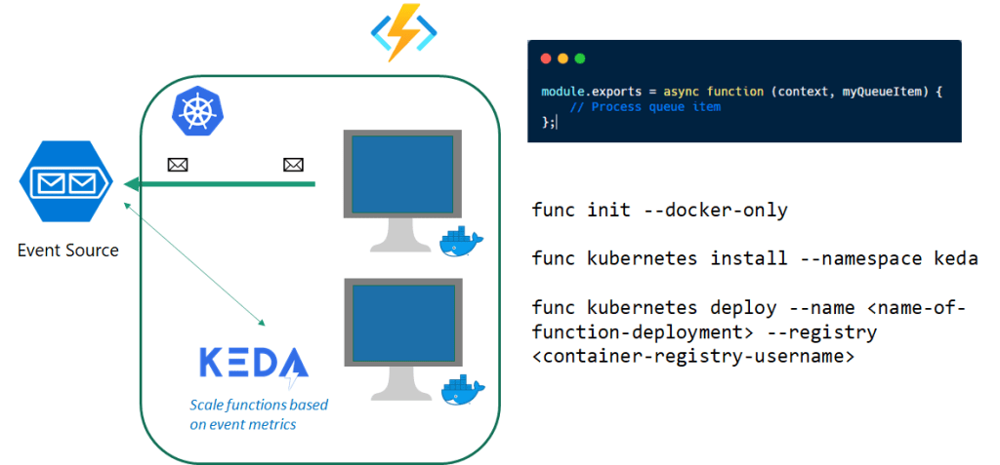

<figcaption>

Serverless eventing with Kubernetes

</figcaption>

</figure>

### **Conclusion :**

We have easily deployed a .NET Core 3.1 Function on Kubernetes which was processing messages from Storage Queue. Once we’ve deployed a `ScaledObject` for our Kubernetes deployment it started scaling the pods out and in according to the queue depth. This makes the application very easily plug in autoscaling with existing application without making any changes!

This makes Kubernetes-based event-driven autoscaling (KEDA) a great addition to the autoscaling toolchain, certainly for Azure customers and ISVs who are building solutions. Hope this was useful in someway! Cheers!
