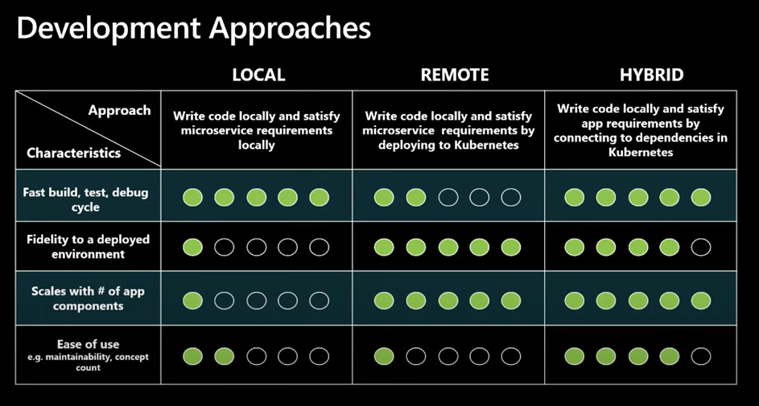
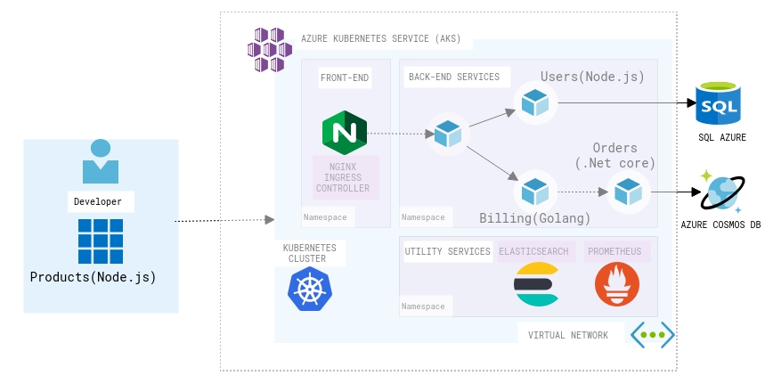
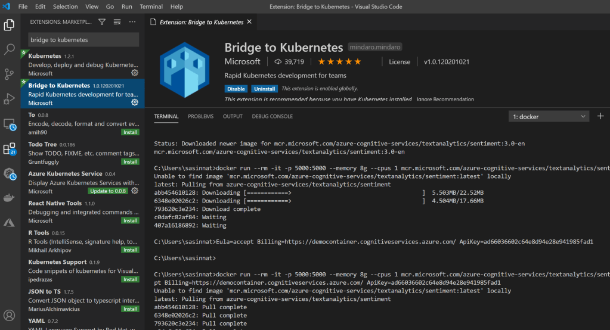

### Overview:

Are you hearing the word Devspaces for the first time?. Let me put this way, Imagine a developer having to deal with a large application which has [chunks of Microservices](https://sajeetharan.wordpress.com/2020/09/26/scale-your-applications-with-kuberenetes-based-event-driven-autoscaling/) and want to get some functionality done?. There will be many risks and one of them would be dealing with right environments. As we know the best way to counter this issue within a team would be to containerize and host it on cloud. Which will let the developer to work on the particular feature and debug the container without creating the environment locally. That is what exactly Azure Dev Spaces does.

**What is Devspaces?**

Devspaces allows you to build, test and run code inside any Kubernetes cluster. With a DevSpace, you run everything remotely inside pods running on top of a Kubernetes cluster. Additionally, the DevSpace CLI takes care things automatically such building and pushing images for you when you make changes to your Dockerfile. If you are making a source code change, the DevSpace CLI does not require you to rebuild and redeploy.

It rather syncs your locally edited source to straight to the containers running inside Kubernetes.  This makes you to edit locally but compile and run everything remotely inside Kubernetes and still use modern development features such as hot reloading. Azure Dev Spaces supports development with a minimum development machine setup. Developers can live debug on Azure Kubernetes Services (AKS) with development tools like Visual Studio, Visual Studio Code or Command Line.

With the recent announcement of Bridge To Kubernetes GA, Azure Dev Spaces will be retired on October 31, 2023. Developers should move to using Bridge to Kubernetes, a client developer tool.

### What is Bridge to Kubernetes?

It was formerly called as Local Process with Kubernetes. Bridge to Kubernetes is an iterative development tool offered in Visual Studio and VS Code through extensions that you can pick up in the marketplace. IT allows developers to write, test and debug microservice code on their development workstations while consuming dependencies and inheriting existing configuration from a Kubernetes environment. There are lot of different tools and methods for solving these kind of challenges when you are working on a single micro-service in the context of a larger application. Those different methods and tools into three main types .There's the local, remote and hybrid approach as shown in the image below

<figure>

<figcaption>

Development Approaches

</figcaption>

</figure>

If you look at the above picture, developers are shifting from Local development methods to hybrid methods which offers the best way to deal with building applications to the cloud with containers/kuberentes. With Hybrid approach, it allows developers to write code on their development workstation, but also allow them to connect to external dependencies that are running in some remote environment. So it actually fulfilling all those external dependencies by connecting them. Let's say if you are running your application on Kubernetes on Azure, you can connect all the dependencies from your local environment and have the whole end-to-end workflow.

<figure>

<figcaption>

Bridge to Kubernetes Scenario

</figcaption>

</figure>

Consider the above scenario in the diagram, Assuming that i am working on a Microservice that deals with Products and the other Microservices which are developed using different stack are deployed on Kubernetes cluster on Azure. If i want to connect to any or multiple microservices and run some integration tests in my local environment Bridge to Kubernetes will help to achieve the requirement. Following are some of the Key features that Bridge to Kubernetes offers similar to Devspaces,

**Accelerating and Simplifying Microservice Development**

It basically eliminates the need to manually push code, configure and compile external dependencies on your development environment so that you can focus on code without worrying about other factors.

**Easy Debugging** **Code**

It lets you to run your usual debug profile with the added kuberentes cluster configuration. It allows developers to debug code in the way they want would while taking advantage of the speed and flexibility of local debugging.

**Developing and Testing End-to-End**

One of the important feature is the Integration testing during development time. Select an existing service in the cluster to route to your development machine where an instance of that service is running locally. Developers can initiate request through the frontend of the application running in Kubernetes and it will route between services running in the cluster until the service you specified to redirect is called same as how you would do debugging by adding a breakpoint in your code.

#### How to get started with Bridge to Kubernetes?

You can Start debugging your Kubernetes applications today using Bridge to Kubernetes.You need to download the extensions from the [Visual Studio](https://aka.ms/bridge-to-k8s-vs-extension) and [VS Code](https://aka.ms/bridge-to-k8s-vsc-extension) marketplaces.

<figure>

<figcaption>

Bridge to Kubernetes VSCode extension

</figcaption>

</figure>

If you would like to explore more with a sample application follow the example given on [Use Bridge to Kubernetes](https://docs.microsoft.com/en-us/visualstudio/containers/bridge-to-kubernetes?view=vs-2019#install-the-sample-application) . Also kindly note the Bridge to Kubernetes collects usage data and sends it to Microsoft to help improve our products and services.

Start using Bridge to kuberentes and deploy things to production even faster than before! Cheers!
