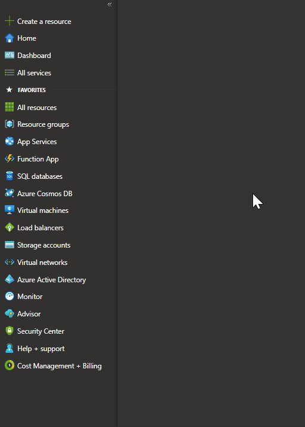

Starting as a fresher in Azure can be difficult because you don't have any previous knowledge regarding Azure and the services that it offers. If you are new to Azure and exploring on azure portal, One of the tips that I wanted to share today with azure enthusiasts is that you can access the [learn Modules](https://aka.ms/learn) while you are in [Azure Portal](http://portal.azure.com/). You can navigate to the service that you want to create and navigate to the links provided next to each service, here is a view,

Hope this helps!
