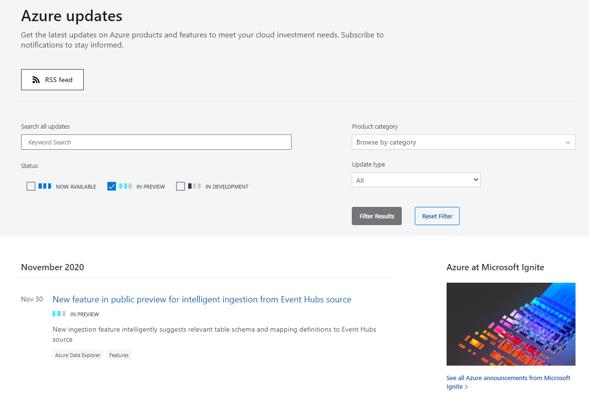
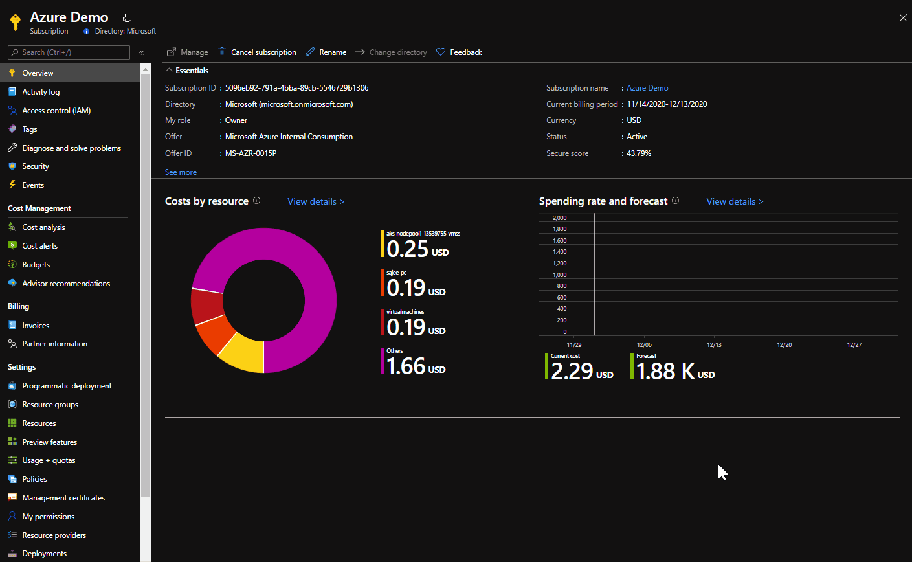

One of the hardest truth is that even as Microsoft employee, i have become very difficult to catch up with Azure updates. It can be said that Azure is constantly evolving day by day.

There’s always a lot of new services and products being offered through Azure, and some of them go into preview before being GA (General Availability).

There are two types of previews in Azure:

- **Private Preview**. An Azure feature marked “private preview” is available to _specific_ Azure customers for evaluation purposes.
- **Public Preview**. An Azure feature marked “public preview” is available to _all_ Azure customers for evaluation purposes.

One of the ways to check for preview features is that , if you browse to the [Azure Updates portal](https://azure.microsoft.com/en-us/updates/?status=inpreview), you can see all new features order per date and not only you can filter for the ones that are in preview, but you can also do a Keyword search.

However, today i noticed a new feature in the azure portal where you can opt into previews right there. You just need to navigate to the subscriptions blade , choose your subscription and click on preview features for your subscription as shown in the image below,

It's a great way to explore the new features, always keep yourself updated with what’s coming for Azure, but more importantly, provide as much feedback as you can. Cheers!

Hope this helps!
