## Overview

Are you are .Net developer interested in building Microservice based applications to the Cloud?. Recently i gave a talk about announcements on [DotNet ecosystem and building Cloud Native applcitions with Tye](https://www.meetup.com/Sri-Lanka-NET-Forum/events/275042627/) and i decided to write on the same topic . [Tye](https://github.com/dotnet/tye) is an amazing project from Microsoft to ease the development, deployment with two fundamental cloud native technologies such as Docker and Kubernetes. If you have been deploying Applications in production using containers, you must be already aware of how complex steps you need to make in order to get your application running. I have worked on multiple projects where I have to run many modules as dependencies at the same time, even though I was only  working on one of them. There has always been a requirement for a tool to start, deploy applications with a  simple command to your desired environment without spending much time on creating docker files, configurations etc.

## What is Project Tye?

Tye is an experimental developer tool from the .NET team at Microsoft that makes developing, testing, and deploying microservices and distributed applications easier. It comprises a local orhestrator to assist the developers to develop microservices, deploy them to kubernetes with minimal configuration and steps.

- Service discovery via configuration conventions makes Developers to expose their API with proper documentation
- Add dependencies (Redis, SQL Server, etc.) without writing docker files
- Run and debug locally using containers and Kubernetes
- Local dashboard for metrics, logging, debugging
- Automatically dockerize and deploy to Azure Kubernetes Service

What I like really like about Project Tye is that it has a very small footprint and it is so simple to get started with after spending so many years with docker and K8s. It offers the following capabilities,

## Getting Started

Let's see how to get started with project Tye. You need to have the following Prerequisites in order to run the following application successfully.

- Azure Subscription (Free Trial)
- Dotnet SDK latest
- Visual Studio / Visual Studio Code
- Docker/Kubernetes Extension VSCode ( Optional)

You can install Project Tye as a global .NET tool. In order to install the utility, you need to run the following command in your terminal

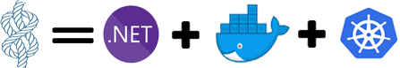

```
dotnet tool install -g Microsoft.Tye --version "0.2.0-alpha.20258.3"
```

To verify that Tye was installed properly you can run the following command that should output the current version installed:

```
> tye --version
```

### Create a Simple Application

This section will demonstrate how to use Tye to run multi-project application.

Step 1 : Make a new folder named **dotnetconfApp**

```
mkdir dotnetconfApp
cd dotnetconfApp
```

Step 2 : Create a frontend project with Razor

```
dotnet new razor -n frontend
```

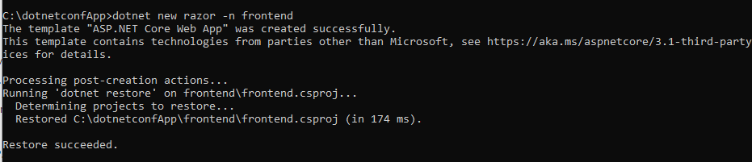

Step 3 : To run the frond end project, execute the following command

```
tye run frontend
```

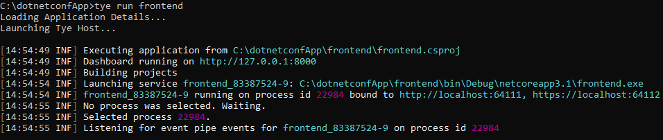

As you could see above tye will do two things: start the frontend application and run a dashboard. Navigate to [http://localhost:8000](http://localhost:8000/) to see the dashboard running.

The dashboard should show the `frontend` application running.

- The `Logs` column has a link to view the streaming logs for the service.
- the `Bindings` column has links to the listening URLs of the service.

<figure>

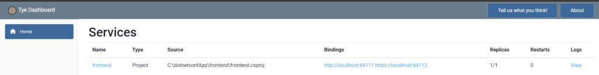

<figcaption>

Project Tye Dashboard

</figcaption>

</figure>

### Add Multiple Projects

Step 1 : Let's go ahead and add a Web API to fetch the data for the front end application. If you haven't already, stop the existing `tye run` command using `Ctrl + C`. Create a backend API that the frontend will call inside of the `microservices/` folder.

```
dotnet new webapi -n backend
```

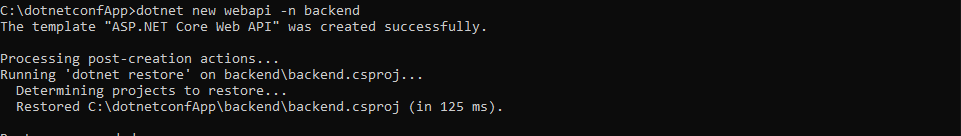

Step 2 : Create a solution file and add both projects

```
dotnet new sln
dotnet sln add frontend backend
```

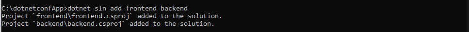

You should have a solution called `dotnetconfapp.sln` that references the `frontend` and `backend` projects.

Step 3: Run the multiple projects with tye . Execute the following command within the solution folder,

```
tye run
```

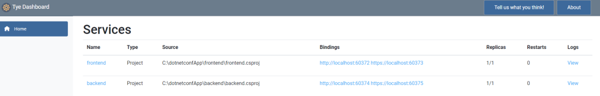

The dashboard should show both the `frontend` and `backend` services. You can navigate to both of them through either the dashboard of the url outputted by `tye run`.

### Make the Communication between the frontend and backend

As you see above, we have both the backend and frontend applications running, let's make them communicate. By default, `tye` enables [service discovery](https://github.com/dotnet/tye/blob/master/docs/reference/service_discovery.md) by injecting environment variables with a specific naming convention.

Step 1: Open the solution folder with VSCode or Visual Studio

Step 2 : As we need to fetch and bind the data from the sample WebApi , lets add a Contract named **WeatherForecast.cs** to the frontend project and it should match the contract that exist in the backend project **WeatherForecast.cs**

```
using System;

namespace frontend
{
    public class WeatherForecast
    {
        public DateTime Date { get; set; }

        public int TemperatureC { get; set; }

        public int TemperatureF => 32 + (int)(TemperatureC / 0.5556);

        public string Summary { get; set; }
    }
}
```

Step 3: Add a file `WeatherClient.cs` to the `frontend` project with the following contents:

```
using System.Net.Http;
using System.Text.Json;
using System.Threading.Tasks;

 namespace frontend
 {
     public class WeatherClient
     {
         private readonly JsonSerializerOptions options = new JsonSerializerOptions()
         {
             PropertyNameCaseInsensitive = true,
             PropertyNamingPolicy = JsonNamingPolicy.CamelCase,
         };
 
         private readonly HttpClient client;
 
         public WeatherClient(HttpClient client)
         {
             this.client = client;
         }
 
         public async Task<WeatherForecast[]> GetWeatherAsync()
         {
             var responseMessage = await this.client.GetAsync("/weatherforecast");
             var stream = await responseMessage.Content.ReadAsStreamAsync();
             return await JsonSerializer.DeserializeAsync<WeatherForecast[]>(stream, options);
         }
     }
 }
```

Step 4 : Add a reference to the `Microsoft.Tye.Extensions.Configuration` package to the frontend project

```
dotnet add frontend/frontend.csproj package Microsoft.Tye.Extensions.Configuration  --version "0.4.0-*"
```

Step 5 : Register  this client in `frontend` by adding the following to the existing `ConfigureServices` method to the existing `Startup.cs` file:

```
...
public void ConfigureServices(IServiceCollection services)
{
    services.AddRazorPages();
     /** Add the following to wire the client to the backend **/
    services.AddHttpClient<WeatherClient>(client =>
    {
         client.BaseAddress = Configuration.GetServiceUri("backend");
    });
    /** End added code **/
}
...
```

This will connect the `WeatherClient` to use the correct URL for the `backend` service.

Step 6 : Add a `Forecasts` property to the `Index` page model under `Pages\Index.cshtml.cs` in the `frontend` project.

```
...
public WeatherForecast[] Forecasts { get; set; }
...
```

Change the **`OnGet`** method to take the **`WeatherClient`** to call the `backend` service and store the result in the **`Forecasts`** property:

```
...
public async Task OnGet([FromServices]WeatherClient client)
{
     Forecasts = await client.GetWeatherAsync();
}
...
```

Step 7 : Change the `Index.cshtml` razor view to render the `Forecasts` property in the razor page:

```
@page
@model IndexModel
@{
     ViewData["Title"] = "Home page";
 }

<div class="text-center">
    <h1 class="display-4">Welcome</h1>
    <p>Learn about <a href="https://docs.microsoft.com/aspnet/core">building Web apps with ASP.NET Core</a>.</p>
</div>

Weather Forecast:

 <table class="table">
     <thead>
         <tr>
             <th>Date</th>
             <th>Temp. (C)</th>
             <th>Temp. (F)</th>
             <th>Summary</th>
         </tr>
     </thead>
     <tbody>
         @foreach (var forecast in @Model.Forecasts)
         {
             <tr>
                 <td>@forecast.Date.ToShortDateString()</td>
                 <td>@forecast.TemperatureC</td>
                 <td>@forecast.TemperatureF</td>
                 <td>@forecast.Summary</td>
             </tr>
         }
     </tbody>
 </table>
```

Step 8 : Run the project with [`tye run`](https://github.com/dotnet/tye/blob/master/docs/reference/commandline/tye-run.md) and the `frontend` service should be able to successfully call the `backend` service!

When you visit the `frontend` service you should see a table of weather data. This data was produced randomly in the `backend` service. Since you are seeing the data in a web UI in the `frontend` means that the services are able to communicate.

If you are getting any issues with the self signed scertifications, you need to run the below commands,

```
dotnet dev-certs https --clean
dotnet dev-certs https --trust
```

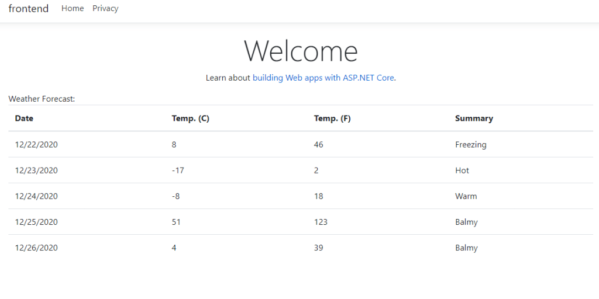

## Let's deploy to Kubernetes

Step 1 : Provision the Kubernetes Cluster, since we will be using Azure Kubernetes Service , you can provision it by either [CLI or using Azure Portal](https://docs.microsoft.com/en-us/azure/aks/tutorial-kubernetes-deploy-cluster)

Step 2 : Let's authenticate and get the required credentials

```
az aks get-credentials --resource-group dotnetconfsl-rg  --name dotnetconf
```

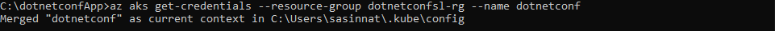

Step 3: You need to have either [Docker registry](https://hub.docker.com/) or [Azure container registry](https://docs.microsoft.com/en-us/azure/aks/tutorial-kubernetes-prepare-acr) created where docker images of the frontend and backend will be pushed.

Step 4 : Now everything is ready do easy deploy the solution. Navigate to the solution folder and execute following:

```
tye deploy --interactive
```

You will be prompted to enter the Container Registry (ex: 'example.azurecr.io' for Azure or 'example' for dockerhub) where the Kubernetes service is installed.

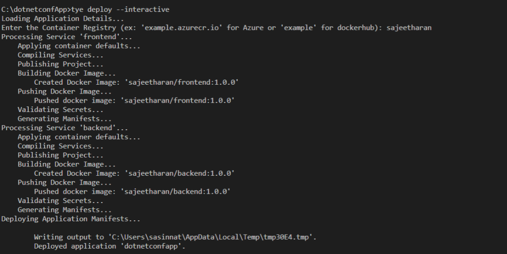

The deployment process has built the docker container and pushed repositories to my registry:

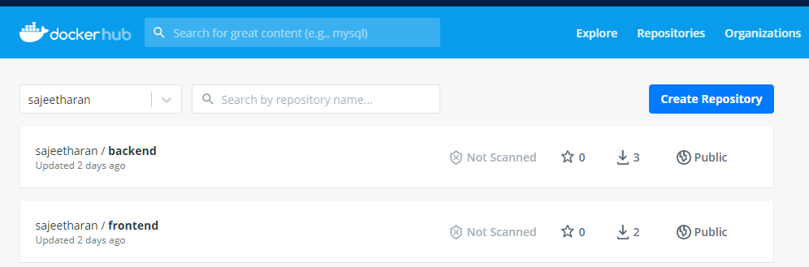

## Test the application

If you are using VScode with the [Kubernetes extension](https://code.visualstudio.com/docs/azure/kubernetes) installed, once you authenticate to Azure using [Azure extension](https://code.visualstudio.com/docs/azure/extensions), you will be able to navigate to the cluster and click on Workloads -> Pods -> Right Click Get

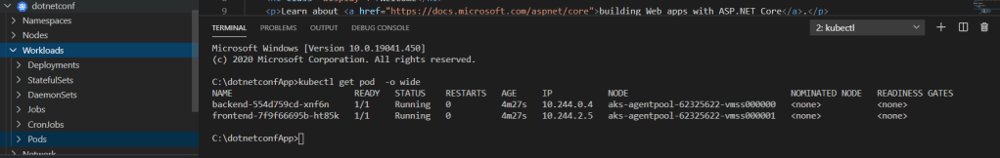

You can also explore the running pods from the Azure portal or using Cloudshell as well. You'll have two services in addition to the built-in kubernetes service.

You can visit the frontend application by port forwarding to the frontend service.

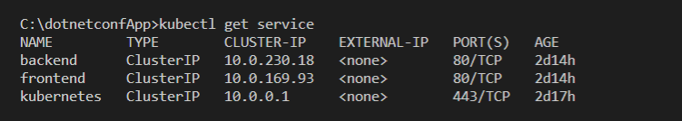

```
kubectl port-forward svc/frontend 5000:80
```

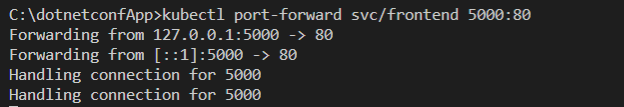

Now navigate to [http://localhost:5000](http://localhost:5000/) to view the frontend application working on Kubernetes. You should see the list of weather forecasts just like when you were running locally.

**Some important Notes:**

⚠️ Currently tye does not provide a way to expose pods/services created to the public internet.

⚠️ Currently tye does not automatically enable TLS within the cluster, and so communication takes place over HTTP instead of HTTPS.

## Conclusion:

In this post I explained how easy it is to get started with [Project Tye](https://github.com/dotnet/tye) and How to run a simple web application. You can certainly do the same adding an external dependency like SQL server or Redis cache without creating docker files manually. In short, Tye simplifies the multiple gestures for all the services within an application to a single command. Even though Project Tye is an experimental tool , you can watch out for more features around service discovery, diagnostics , observability, configuration and logging when it comes to building cloud native applications with Microservices. Certainly it's a great addition to the tooling what .Net ecosystem provides and hope you will consider exploring it more. Cheers!
