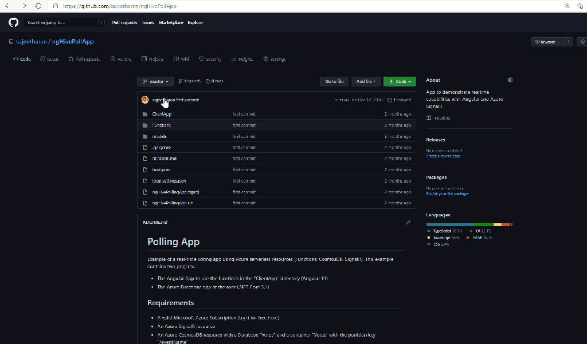

Exactly a year ago, Github announced [codespaces](https://github.com/features/codespaces) and gave the option to join the beta. If you are having your repository in github and need to contribute to an open source project or if you want to commit something quickly to the repository this is one of the feature that you might be interested in, It supports developers to do it on the browser on any device.

It allows developers to use a fully-featured, cloud-hosted development environment that spins up in seconds Directly within Github. This will help you to start contributing to a project immediately from any machine, all without needing to install anything locally. If you are a developer, you should be a fan of this one. As we’ve all been adopting practices like social distancing and remote working, development teams have become more distributed. In this post, i wanted to share one of the productivity tips on how to open your code directly from the browser via codespaces.

You just need to open your repository and add "**1s**" after **github** when viewing the codebase on browser and github codespaces loads up instantly.

Here is the action below!

One thing to note here is that, this feature is not directly from the Github codespaces itself, it is enabled via the [1s](https://github.com/conwnet/github1s) which is sort of a middleware repository enabling this! However it's a great feature and worth exploring it!

Hope this enable more developers to contribute to Opensource world instantly. Cheers!
