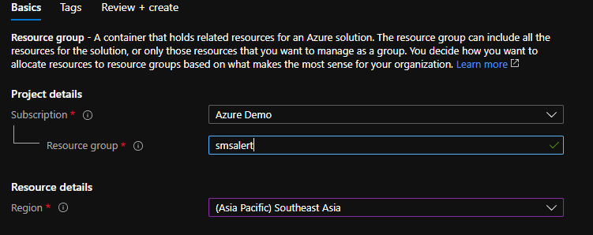
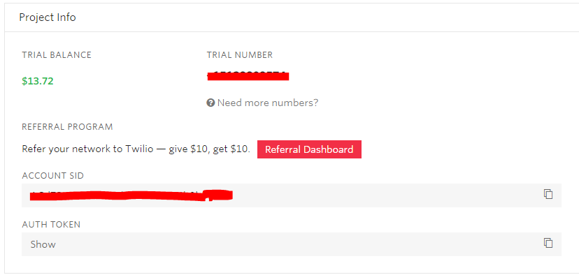
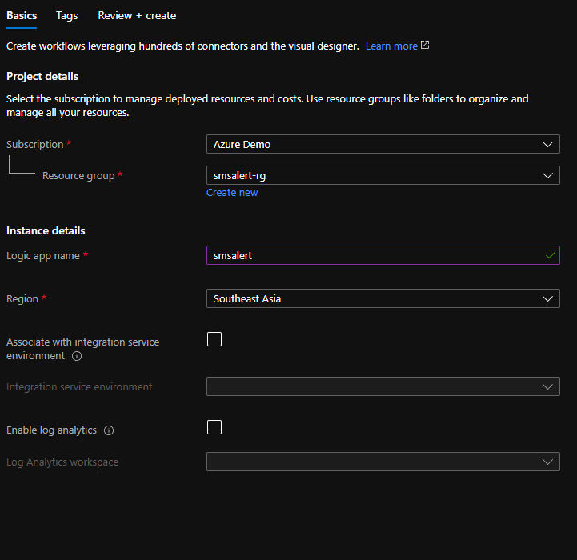
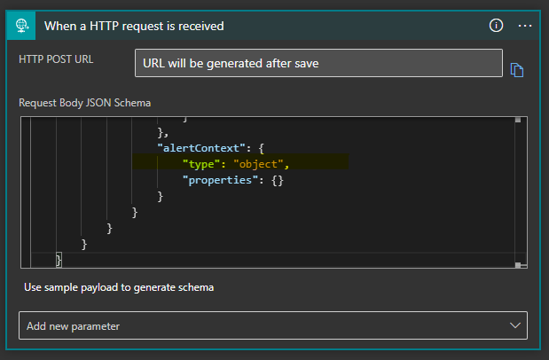
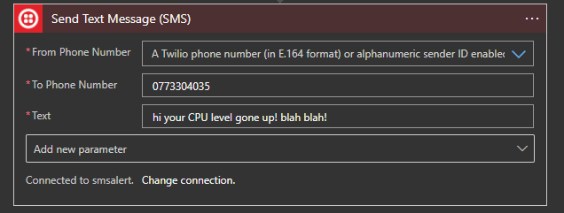
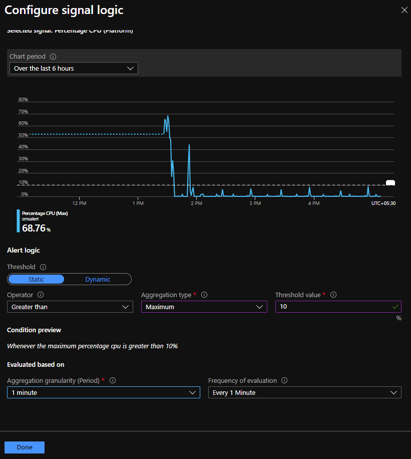
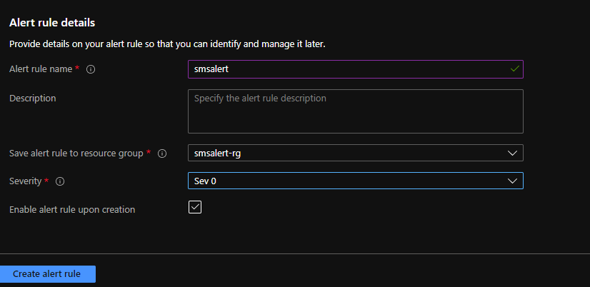

If you are hosting your application on any environment whether it's in cloud or on-prem, an effective monitoring helps to increase the uptime by proactively notifying us of critical issues so that you resolve them before they become problems. An effective monitoring is a part of Devops process which helps you to achieve the following,

- A proactive approach.
- Get visibility of your infrastructure and application issues
- React fast to an issue and mitigate quickly.
- Increase your application availability
- Reduce application downtime

I have been involved in lot of discussions with customers and partners on how to setup alerts in order to proactively get to know the issues and help the customers. One of the frequent questions i noticed is that about how to setup SMS alerts. In this post i wanted to cover about how to setup SMS alert on Azure at a minimal cost.

#### PreRequisities:

You will need to have an Azure Subscription. If you do not have an Azure subscription you can simply create one with free trial.

#### Services used:

- Azure Logic Apps
- Azure Monitor
- Twilio API
- Azure Virtual Machine

There is no SMS notification service readily available on Azure as of now. Even though [Azure Communication Service](https://azure.microsoft.com/en-us/services/communication-services/) which Integrate SMS into existing applications and workflows with Azure services Logic Apps and Event Grid is still in preview and not supported in many countries. In this case you could integrate with any of the SMS providers. In this case i will use one of the famous SMS provider which i have used in many of the projects in the past.

**Step 1 :** **Create the Resource Group**

As the first step, we need to create the resource group that contains all the resources needed. In your case, you might already have an Azure environment with all the resources. Navigate to Azure Portal and create the resource group named **“smsalert”**

<figure>

<figcaption>

Create Resource Group

</figcaption>

</figure>

**Step 2 : Create the application and deploy on Azure VM**

In this case, i will be focusing on setting up alerts on a Virtual Machine, If you already have an application deployed on any compute services such as AppService or AKS you could replicate the same steps. You might not need to do this step as its about application deployment. I will use the Devops starter resource to deploy a Dotnet core application and choose VM as the compute option to deploy my application.

Search for Devops starter in the search bar and create a new ASPNet core application and choose VM as the destination to be deployed.

<figure>

<figcaption>

Deploy ASPNET core app using Devops starter

</figcaption>

</figure>

Once the application is deployed you could access the application from the url and you can login to the VM as well.

<figure>

<figcaption>

ASPNetCore app on VM via Devops starter

</figcaption>

</figure>

Now we have the application deployed on VM, assume if you want to monitor the performance and setup alert whenever it breaches certain condition, lets setup azure monitor integrated with Logic apps.

**Step 2 : Create Logic app Integrated with Twilio**

You need to setup a Twilio account inorder to send the SMS alerts, the free tier gives a worth of 15$ credits which would be enough for 4000 messages. You will also get a number to send SMSes from the account portal. If you need a custom number you can set it up with extra cost.

<figure>

<figcaption>

Twilio SMS account

</figcaption>

</figure>

Let's create the logic app, you can search for Logic app resource on the search bar and create a Logic app with the name smsalert under the same resource group.

<figure>

<figcaption>

Logic App to send SMS alerts

</figcaption>

</figure>

Next step is to configure the steps in logic app , whenever a request is received from the azure monitor, we need to send the SMS to relevant members in the team which can be configured with 2 steps as below,

Add the first step as when an http request is received and we need to map the [schema](https://docs.microsoft.com/en-us/azure/azure-monitor/platform/alerts-common-schema-integrations) of alert inorder to get the information from the alert and to send the sms. Paste the schema object in the request body.

Next step is to add the twilio connector inorder to send the SMS when an alert is recieved. you can configure the twilio **send text message** step as below, you need to pass the account SID and the access token in the configuration.

You can also pass a custom text which consists of any of the parameters that recieved from the alert, say for ex. CPU percentage, time etc.

<figure>

<figcaption>

Twilio configuration

</figcaption>

</figure>

Now we are ready with the logic app integrated with Twilio, next step is to create the alert rule on the vm to send the SMS

**Step 3 : Setup Alert Rule to send SMS notification.**

Open the VM resource , on the blade navigate to Alerts and click on new alert rule, by default you can see that the resource is selected as the VM, next step is to setup the condition when you need to fire the alert, this can be a combination of multiple configurations, you can choose it from the predefined configurations. In this case i will choose the condition as "When the percentage CPU goes above 10%".

<figure>

<figcaption>

Setup condition for Alert

</figcaption>

</figure>

<figure>

<figcaption>

Fire alert when the CPU percentage goes over 10% over a period of 1 min

</figcaption>

</figure>

We are good with the condition just for this demo purpose, but you can play around multiple conditions in combinationas you need for your environment.

**Step 4: Add Action Group**

In the "Add action group" section, we have to create an Action Group Name and we need to choose the Logic app as action and select the logic app which you have created in the above step,

Once you are done with the action group, just pass the alert rule details and set the severity level.

We are done with all the steps needed to send the SMS alert, now whenever the CPU usage goes above 10% the configured number will get an SMS message. If you want to send the SMS to multiple members in the team, you could just use the for condition in logic app and send it to multiple members.

**Step 5 : Manage Alert Rules**

You can also manage the alert rules based on the severity and if the action has been taken on those alerts and recrtified from the manage alerts section.

That's all i wanted to cover in this post, one thing to note is that i have seen many customers who already have setup email notifications via the Azure monitor, but **SMS is not still readily available in all countries** if you've noticed.

Hope this helps to setup SMS alerts on any resource that you use as compute option to run your application. Cheers!
