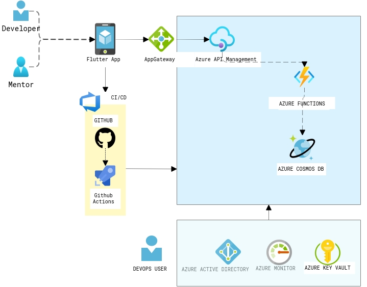

### Overview

As per a survey, 57% of young individuals agreed they do not have the right connections to find a mentor and more than 50% of them couldn't find a job that they are passionate about. As a result I was exploring if there is any platform that would solve this major problem. Yes, there are some existing online apps but those don't serve the complete purpose to the extent that i expected. I decided to start a pet project to build this platform during my spare time , in this post i will be sharing the architecture of the application and how i was able to quickly spin up this application.

###  **Prerequisites to build and deploy**

As an Azure fan, i have used Azure as the cloud platform to deploy this solution. Here are some prerequisites first:

- An [Azure](https://azure.microsoft.com/en-us/) account (don’t worry, deploying this app costed me almost **nothing**, you can use free trial)
- [node](https://nodejs.org/en/) and [npm](https://www.npmjs.com/) (preferably the latest versions)
- VSCode and Android Studio

As i explained in the previous posts, [Cosmosdb](https://docs.microsoft.com/en-us/azure/cosmos-db/introduction) and [Azure Functions](https://docs.microsoft.com/en-us/azure/azure-functions/functions-create-serverless-api) are great combo to build applications and deploy in quick time without worrying about underlying infrastructure. You can read about some of the reference architectures i have posted in the past from the below links,

- [Game with Cosmosdb](https://sajeetharan.wordpress.com/2020/02/28/covid-escape-game-with-cosmosdb-and-python/)
- [How Azure CosmosDB + Functions + IOT hub + PowerBI could solve the burning Traffic problem](https://sajeetharan.wordpress.com/2019/06/13/how-azure-cosmosdb-functions-powerbi-iot-hub-could-solve-the-burning-traffic-problem/)
- [Facial Recognition solution for the fraud prevention using Azure AI and Cosmosdb](https://sajeetharan.wordpress.com/2020/02/20/how-to-build-facial-recognition-solution/)
- [Github Issue Reporter with Azure Function and CosmosDB](https://sajeetharan.wordpress.com/2020/02/02/create-github-issue-report-with-azure/)

Let me dive into each component in the architecture of 'MentorLab'.

### **How it works?**

MentorLab has been made to scale up the existing students and mentors using Azure Services and Serverless Architecture to provide a cost-economic one stop solution which is dependable and truly secure. The objective is to give the students a platform which is built on a **serverless architecture** and can be remotely accessed irrespective of geographic location.

### There are two facets of this solution

- Mentor Side - Dashboard (Flutter)
- Students Side - Mobile App (Flutter)

#### Azure Services Used 

- Github Actions
- Active Directory (A2D)
- Blob Storage
- Azure Cosmos DB
- API Management
- Azure Functions
- Monitor

<figure>

<figcaption>

Architecture of MentorMe App

</figcaption>

</figure>

Flutter App is the front end application which is accessed by Mentor and Developer with different types of logins, All the requests from the mobile app will be router via the [AppGateway](https://docs.microsoft.com/en-us/azure/application-gateway/overview). The backend APIs are built as servelress APIs with Azure functions with the support of [Cosmosdb](https://docs.microsoft.com/en-us/azure/azure-functions/functions-create-cosmos-db-triggered-function) Trigger. [Cosmosd's serverless](https://docs.microsoft.com/en-us/azure/cosmos-db/serverless) feature is a great offering when building these kind of applications, as it is a cost-effective option for databases with sporadic traffic patterns and modest bursts. It eliminates the concept of provisioned throughput and instead charges you for the RUs your database operations consume. In this scenario, i have chosen Mongo API for the CRUD operations. The APIs are registered as endpoints with the Azure API management with right policies in place.

Some of the additional components you could see in the diagram are the CI/CD pipelines with Github Actions and Azure AD B2C for the authorization, Key vault for storing the connection strings,keys in a secured way. And finally application insights to generate the related metrics and for troubleshooting.

It nearly took just 3 days to build this application and going forward i am planning to add more features such as video conferencing with the help of [Azure Communication](https://azure.microsoft.com/en-us/services/communication-services/) and [Media services](https://azure.microsoft.com/en-us/services/media-services/) . All these components just costs 36$/Month to host this application on Azure.

Hope this reference architecture helps you to kickstart your work for similar application. Feel free to add your thoughts/Questions as comments in the section below. Happy Hacking!
