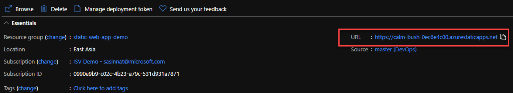

Microsoft introduced App Service Static Web Apps in Preview at Build 2020 as"[Azure static web apps](https://azure.microsoft.com/en-us/services/app-service/static/)", a service which allows web developers to build and deploy website to any environment from Github repository for free. Developers can deploy applications in minute while taking the advantage of scaling and cost savings offered by azure functions as backend. One of the frequent questions that i heard from the developers was the availability of Azure Devops support with Azure static web apps.

I have already published an article which demonstrates how to deploy to Azure Static Web Apps using [GithubActions](https://sajeetharan.wordpress.com/2020/05/20/azure-static-web-apps/). Azure static web apps team announced the public preview of [Azure Devops with Azure static web apps](https://azure.microsoft.com/en-us/updates/public-preview-azure-static-web-apps-now-supports-deployment-with-azure-devops/) yesterday.

In this post you I will walk you through on how to deploy an angular application to Azure static web apps using Azure [Devops](https://dev.azure.com/).

## PreRequisites:

- An [Azure](https://azure.microsoft.com/en-us/) account (you can use free trial, If you don't have one, you can [create an account for free](https://azure.microsoft.com/free/))
- Azure DevOps  (If you need help getting started, see [Create](https://docs.microsoft.com/en-us/azure/devops/pipelines/create-first-pipeline?view=azure-devops&preserve-view=true) one)

## Step 1 : Create a Devops repository

Navigate to [Dev.Azure.com](https://dev.azure.com/) and create a new Devops Repository as below

<figure>


<figcaption>

Azure Devops repository

</figcaption>

</figure>

## Step 2 : Import your static web application to Azure Devops repository

[https://github.com/microsoft/static-web-apps-gallery-code-samples](https://github.com/microsoft/static-web-apps-gallery-code-samples)Next step is to import the web application from any source control to your newly created Azure Devops repository. In this case i am importing the same "[Meme generator](https://github.com/sajeetharan/meme4fun)" app which was made of Angular. Meme4Fun is an app to create custom programming memes from a picture and it also identifies features of people in the image which is available as part of code samples for Azure static web apps.

<figure>


<figcaption>

Import Repository to Azure Devops

</figcaption>

</figure>

## Step 3 : Create a static web app on Azure

Next step is to create the static web application on azure, navigate to azure portal and create a new resource by searching for Static Web apps, and create it.

**Note** : **Since I am going to leverage Azure Devops as the deployment method, select Other as the option.**

<figure>


<figcaption>

Choose Devops as the Deployment

</figcaption>

</figure>

Once the deployment is successful, navigate to the new Static Web Apps resource and select Manage deployment token.

<figure>


<figcaption>

Manage deployment token

</figcaption>

</figure>

## Step 4: Create the Pipeline task in Azure Devops

If you are using Azure Devops to deploy applications in the past, you will need to have the pipeline in plact to deploy to particular resource. In this case, lets create a build pipeline to deploy the angular application.


Next step is to select the template, since we are deploying an angular application, you can select the template as angular with nodejs

<figure>


<figcaption>

Angular template

</figcaption>

</figure>

Also for static web apps it is important to include the following step in the yaml which has the **a`pp_location`, `api_location`, and `output_location`** , you need to pass those values if you have those details if not keep it empty.

<figure>


<figcaption>

[Different values details](https://docs.microsoft.com/en-us/azure/static-web-apps/publish-devops)

</figcaption>

</figure>

and the final configure YAML will look similar to the below,

```
# Node.js with Angular
# Build a Node.js project that uses Angular.
# Add steps that analyze code, save build artifacts, deploy, and more:
# https://docs.microsoft.com/azure/devops/pipelines/languages/javascript
trigger:
- master
pool:
  vmImage: ubuntu-latest
steps:
- task: NodeTool@0
  inputs:
    versionSpec: '10.x'
  displayName: 'Install Node.js'
- script: |
    npm install -g @angular/cli
    npm install
    ng build --prod
  displayName: 'npm install and build'
- task: AzureStaticWebApp@0
  inputs:
      app_location: "/" 
      api_location: "api"
      output_location: "dist/meme4fun"
  env:
      azure_static_web_apps_api_token: $(deployment_token)
```

Next step is to provide the The `**azure_static_web_apps_api_token**` value is self managed and is manually configured. Select Variables in the pipeline and create a new variable named as "deployment\_token"(matching the name in the workflow) below.

<figure>


<figcaption>

Add new Variable

</figcaption>

</figure>

<figure>


<figcaption>

Paste the deployment\_token value which was copied from Azure portal

</figcaption>

</figure>

Make sure to check "Keep the value secret" and save the workflow and run.


With that step Azure Devops will execute the pipeline and deploy the application to azure static web apps.

<figure>


<figcaption>

Successful deployment

</figcaption>

</figure>

Now you can access the application from the static static web app from the URL.

<figure>



<figcaption>

Static web app with azure devops deployment

</figcaption>

</figure>

If you had any trouble in executing the above steps, you can watch the same tutorial published as a video [here](https://www.youtube.com/watch?v=8m82Lh3yai8).

It's great to see that with few steps of configuration, i was able to deploy the application with Azure Devops. If you have enabled backend support with the azure functions, it can be deployed as well. Support with Azure Devops has been one of the most requested features by developers and great to see it in live now. It's your chance to explore various application deployments with different frameworks, hope this is useful. Cheers!
