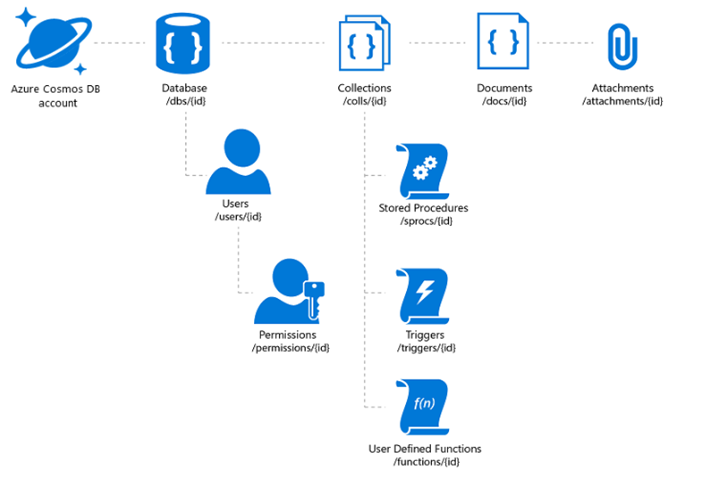
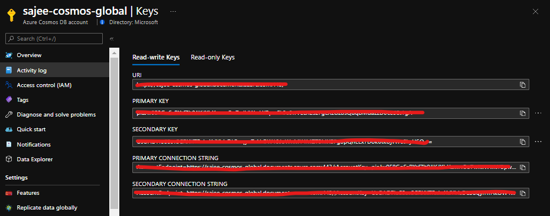
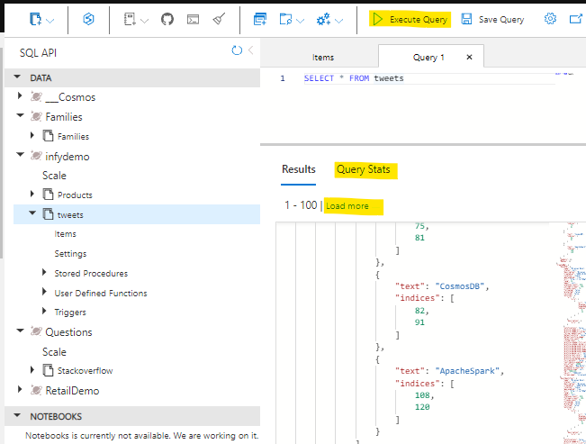
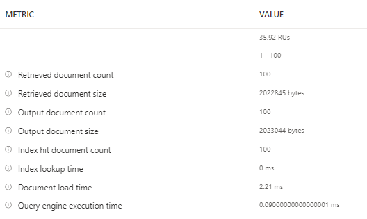

## Overview :

In this blog post you will learn about the Azure Cosmos DB SQL API queries and How to get started with Cosmos DB SQL API. I recently published a [video on youtube](https://www.youtube.com/watch?v=20281Cl-GvM) and decided to have it available in blog as well. [Azure Cosmos DB](https://docs.microsoft.com/en-us/azure/cosmos-db/introduction) is a fully managed NoSQL multi model database service provided by Azure which is highly available, globally distributed, and responds back within the minimum latency in single digit millisecond. It's becoming the preferred database for developers on Azure to build modern day applications.

You can access the [slides here](https://slides.com/sajeetharan/cosmos-sql) and repository for the queries [here](https://github.com/sajeetharan/Cosmosdb-sql-api).

Azure supports multiple data models including documents, key-value, graph, and column-family with multi models APIs such as SQL,Mongo,Cassandra,Gremlin and Table. SQL APi is one of them and its oldest offerings on cosmos db. SQL API is also known as Core API which means that any new feature which is rolled out to cosmos db usually first available in SQL API accounts. It supports for querying the items using the Structured query language Syntax which provides a way to query JSON objects.

Also cosmos db SQL API queries can be done using any SDK we provide with Net, Java, Node and python.

<figure>



<figcaption>

Azure Cosmos DB SQL API

</figcaption>

</figure>

Azure Cosmos DB is truly schema-free. Whenever you store data, it provides automatic indexing of JSON documents without requiring explicit schema or creation of secondary indexes.

The Azure Cosmos DB database account is a unique name space that gives you access to Azure Cosmos DB.

A database account consists of a set of databases, each containing multiple collections, each of which can contain stored procedures, triggers, UDFs, documents, and related attachments.

<figure>


<figcaption>

Cosmos DB SQL API Account Structure

</figcaption>

</figure>

## Ways to Manage Cosmosdb Documents :

With the Cosmos DB SQL API , you can create documents using a variety of different tools :

**Portal**: The Data Explorer is a tool embedded within the Azure Cosmos DB blade in the Azure Portal that allows you to view, modify and add documents to your Cosmos DB API collections. Within the explorer, you can upload one or more JSON documents directly into a specific database or collection which i will be showing in a bit

**SDK**: Cosmos DB database service that was released prior to Azure Cosmos DB featured a variety of SDKs available across many languages

**REST API** : As we mentioned previously, JSON documents stored in SQL API are managed through a well-defined hierarchy of database resources. These resources are each addressable using a unique URI. Since each resource has a unique URI, many of the concepts in Restful API design applies to SQL API resources

**Data Migration Tool:** The open-source Cosmos DB data [migration tool](https://github.com/azure/azure-documentdb-datamigrationtool) which allows you to import data into a SQL API collection from various sources including MongoDB, SQL Server, Table Storage, Amazon DynamoDB, HBase and other Cosmosdb collections.

## Prerequisites:

For this overview demo , I will be using a dataset Tweets which contains Tweets by users across the world on certain tags says **#Azure** and **#Cosmosdb**

To replicate the demo you can use the Emulator which you can download from here [Cosmosdb Emulator](https://docs.microsoft.com/en-us/azure/cosmos-db/local-emulator) . Or you can create a [Cosmosdb free tier](https://docs.microsoft.com/en-us/azure/cosmos-db/free-tier) account which is handy for developers.Azure Cosmos DB free tier makes it easy to get started, develop, test your applications, or even run small production workloads for free. When free tier is enabled on an account, you'll get the first 1000 RU/s and 25 GB of storage in the account for free.

In this demo let me migrate this sample dataset tweets which has 1000 recent tweets from users who actually tweeted about different technologies. I have uploaded the [dataset](https://github.com/sajeetharan/Cosmosdb-sql-api) in my github account and we will be using the same to understand different queries.

- Create a CosmosDB Account of type SQL API and database/collection named Tweets
- Insert the data inside the folder Tweets to CosmosDB using the [Data Migration Tool](https://docs.microsoft.com/en-us/azure/cosmos-db/import-data)

## SQL API Queries :

Once you created the Cosmos DB account on Azure , Navigate to **Settings -> Key** and copy the Endpoint and the Url for the Cosmos DB account and replace the values in the [Program.cs](https://github.com/sajeetharan/Cosmosdb-sql-api/blob/master/Program.cs) ( This is not recommended for production use , use Keyvault instead).

<figure>



<figcaption>

Obtain Keys and Endpoint from Azure portal

</figcaption>

</figure>

```
  // The Azure Cosmos DB endpoint for running this sample.
  private static readonly string EndpointUri = "https://sajee-cosmos-notebooks.documents.azure.com:443/";
  // The primary key for the Azure Cosmos account.
  private static readonly string PrimaryKey = "==";
```

Before dive into the queries , let me explain one of the most important thing to deal with queries in Cosmos DB. In Cosmos DB SQL API accounts, there are two ways to read data.

P**oint reads –** Which denotes you can do a key value lookup on a single item id and a partition key. Point reads usually cost 1 RU With a latency under 10 Milli seconds.

**SQL queries** - SQL queries consume more Rus in general than the point reads . So if you need a single item, point reads are cheaper and faster.

As a developer we tend to execute select \* from table which might cause you more RUs since you are reading the whole data across multiple partitions.

<figure>


<figcaption>

Query vs Point Read

</figcaption>

</figure>

Let's dive into some of the queries with SQL API

#### **Query 1 : Select All**

To retrieve all items from the container, in this case let's get all the tweets. Type this query into the query editor:

```
SELECT *
FROM tweets
```

...and click on **Execute Query!**

<figure>



<figcaption>

Cosmos DB SQL API queries

</figcaption>

</figure>

Few things to note here are, It retrieves the first 100 items from the container and if you need to retrieve the next 100, you could click on load more , under the hood it uses the pagination mechanism. Another handy thing here is that you can navigate to query stats and see more details on the query such as RUs, Document size, Execution time etc.

<figure>



<figcaption>

Query Metrics

</figcaption>

</figure>

#### **Query 2 : Filter Path**

When referring to fields you must use the alias you define in the `FROM` clause. We have to provide the full "path" to the properties of the objects within the container. For example, if you need to get the RetweetCount from the container for all the items.

SELECT tweets.RetweetCount  
FROM tweets

#### **Query 3 : Join**

Lets see how we can find out the hashtags that have been used in all the tweets. We can use the `JOIN` keyword to join to our hashtags array in each tweet. We can also give it an alias and inspect its properties.

Let's see the `JOIN` in action. Try this query:

```
SELECT hashtags
FROM tweets
JOIN hashtags IN tweets.Hashtags
```

Now that we know how to join to our child array we can use it for filtering. Lets find all other hashtags that have been used along with the known hashtags (#Azure, #CosmosDB):

```
SELECT hashtags
FROM tweets
JOIN hashutcDate IN tweets.Hashtags
WHERE hashtags.text NOT IN ("CosmosDB", "Azure")
```

Similarly we can use OR,IN,DISTINCT,GROUPBY etc.

#### **Query 4 : KEYWORDS (IN,OR etc)**

To return the entire tweet where the indices of the hashtag is between 11 and 18 simply by selecting the tweets rather than the indices

```
SELECT tweets
FROM tweets
JOIN hashtags IN tweets.Hashtags
JOIN indices IN hashtags.indices
WHERE indices BETWEEN 11 AND 18
```

#### Query 5 : ORDERBY and TOP

We can also order our query so we can find the most recent tweet(s) and retrieve the top 5 tweets. (use ASC for ascending and DESC for Descending) :

```
SELECT TOP 5 tweets
FROM tweets
JOIN hashtags IN tweets.Hashtags
JOIN indices IN hashtags.indices
WHERE indices BETWEEN 21 AND 28
ORDER BY tweets
```

#### Query 6 : PROJECTION

We can use a feature called **Projection** to create an entirely new result set. We could use this to create a common structure or to make it match a structure we already have.

Try this query:

```
SELECT tweets.CreatedBy.Name AS Name,
		tweets.FullText AS Text,
		tweets.CreatedAt AS CreatedTime,
        tweets.TweetDTO.metadata.iso_language_code AS LanguageCode
FROM tweets
```

#### Query 7 : USER DEFINED FUNCTION

The SQL API supports javascript User defined functions, there that you can use on this server called **displayDate** which removes the time parts of a UTC date string.

This is the function :

```
function displayDate(inputDate) {
    return inputDate.split('T')[0];
}
```

Let's have a go at using it

```
SELECT tweets.CreatedAt,
    udf.displayDate(tweets.CreatedAt) AS FormattedDate
FROM tweets
```

The SQL API also supports stored procedures written in JavaScript which enables you to perform ACID transactions over multiple records. This allows scalable and almost unlimited expandability on the functionality Azure Cosmos DB can offer.

These are some of the basic queries to get started with CosmosDB SQL API. If you want to get to know more about SQL API the following references would be useful.

- [SQL API quickstart](https://docs.microsoft.com/en-us/azure/cosmos-db/sql/create-sql-api-dotnet)
- D[ata Migration Tools Cosmos DB](https://docs.microsoft.com/en-us/azure/cosmos-db/import-data)

Hope this post help you get started with CosmosDB SQL API! Cheers!
